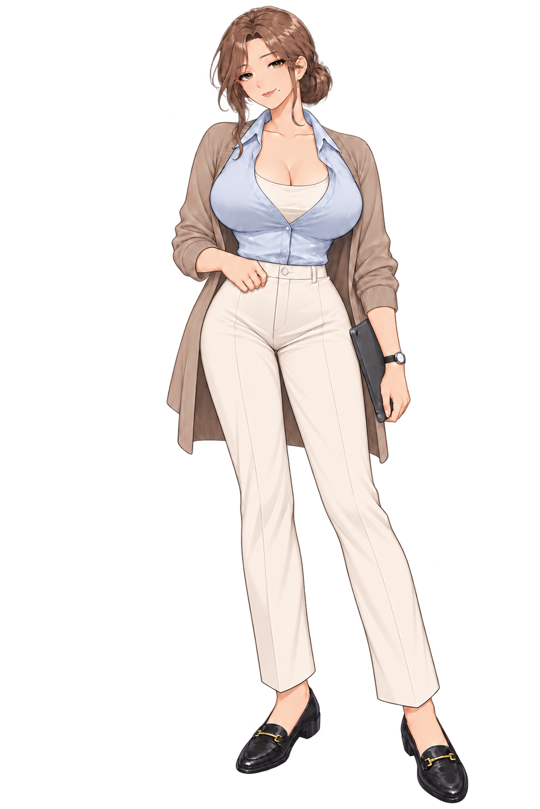
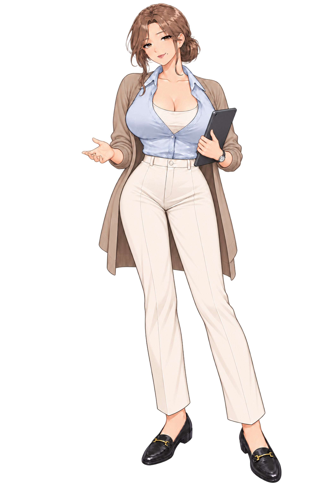
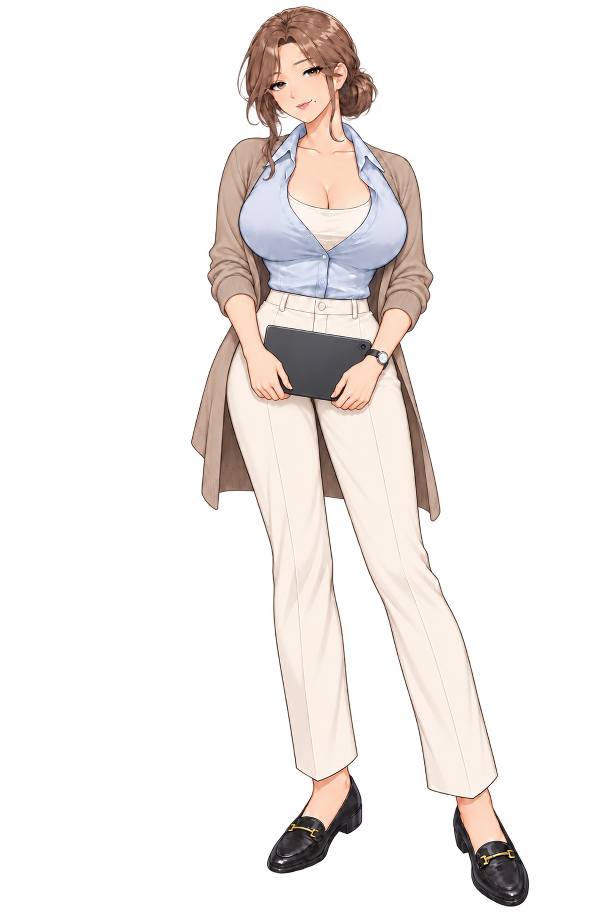
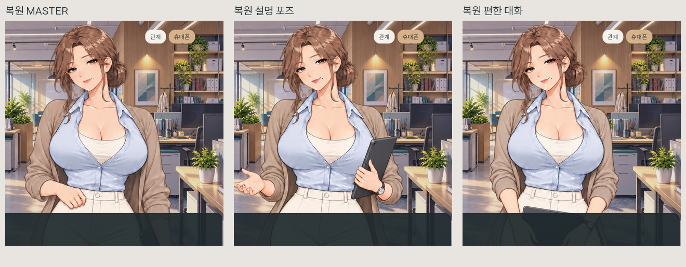

# 서윤 MASTER 확정·포즈·원화 색과 질감 복원

2026-10-07. 사용자 채택 비율·화장·매력점 MASTER와 처음 생성한 업무/편한 대화 포즈를 기준으로 복원했습니다.

## 현재 결과

- MASTER: 사용자 채택한 작은 머리/긴 다리 비율, 화장과 입가 매력점 유지.
- 설명 포즈: 세운 태블릿 + 낮은 손짓. 편한 대화 포즈: 태블릿을 양손으로 낮게 들기.
- 손과 손가락은 첫 포즈 원화의 성인 비율을 보존. 귀 수정 과정에서 손을 다시 그리지 않음.
- 귀의 흰 원형 장식/돌기는 귀 확대 부분만 내장 image_gen으로 수정. 해당 작은 부분만 원본에 합성.
- 미혼인 40세로 최연장자. 기획 16년/현 회사 9년, 경험에서 나오는 여유와 자신감을 설정에 반영. 지현의 팀장 직위, 다른 히로인의 나이, 스토리 코드는 유지.

## 색·질감이 달라진 원인과 복구

귀처럼 작은 부분을 수정하면서 전신을 반복 생성한 것이 잘못된 처리였습니다. 반복 생성본은 머리·옷·피부의 질감과 색이 승인 원화에서 달라졌습니다. 수정 과정의 전신 재생성본을 현재 기준으로 사용하지 않고 사용자 채택 MASTER와 최초 포즈 원화로 돌아왔습니다.

이제 전신을 다시 생성하지 않습니다. 귀만 확대해 수정한 결과를 원본의 작은 영역에 넣었습니다. 원본 PNG의 색 프로필/감마 관련 메타데이터도 유지했습니다. 서윤의 추가 색 보정 필터를 껐고 새 질감을 만드는 확대 보정도 사용하지 않았습니다. 원화 보존 2배 확대본은 모두 2048×3070 RGBA입니다.

## 픽셀·게임 검증

| 자산 | 원화 귀 수정 영역 | 귀 바깥 바뀐 RGBA 픽셀 | 바뀐 알파 픽셀 |
|---|---|---:|---:|
| MASTER | 34×36 픽셀 | 0 | 0 |
| 설명 | 34×36 픽셀 | 0 | 0 |
| 편한 대화 | 34×36 픽셀 | 0 | 0 |

눈·입·화장·매력점·몸·옷·손의 그림은 원본 그대로입니다. ‘귀 바깥 동일’은 각 파일의 승인/최초 원화와 비교한 결과로, 세 포즈가 서로 같은 그림이라는 뜻은 아닙니다. 귀 주변 보간 여유 영역 바깥의 2배 확대 픽셀도 원래 원화 확대본과 일치합니다.

게임 렌더러가 각 스프라이트 파일을 직접 표시한 결과와 정확히 같은지를 세 장 모두 확인했습니다. DAY 2 진입, 일반/확대 구도, 포즈 전환, 저장·불러오기, 휴대폰 표시 중 캐릭터 숨김 포함 26개 검사 통과. 검사 중 카메라는 고정해 전후 크기 차이가 섞이지 않도록 했습니다. 기존 설정 문서와 캐릭터 비교표는 40세·미혼·최연장자로 갱신했습니다.

이미 켜 둔 게임은 재실행하면 복원된 자산과 원화 색이 표시됩니다. 앞선 전신 재생성본·포즈·보정값은 백업과 작업 이력에 보존했습니다.

## 전신 결과

### 확정 MASTER

### 설명 포즈

### 편한 대화 포즈

## 게임 화면 비교

내장 image_gen으로 귀만 수정했습니다. [정확한 생성 프롬프트](../../../원본자료/승인원화_보존/한서윤_원화보존_귀국소수정_20261007_v1/귀국소수정_생성프롬프트.json) · [원화 픽셀 검증](../../../원본자료/승인원화_보존/한서윤_원화보존_귀국소수정_20261007_v1/국소수정_픽셀검증.json) · [복원·업스케일·게임 기록](../../../원본자료/승인원화_보존/한서윤_원화보존_귀국소수정_20261007_v1/복원과국소수정_목록.json)

원화 복원 전 백업: C:\Users\user\Desktop\건\오피스\변경백업\20261007_서윤원화복원
