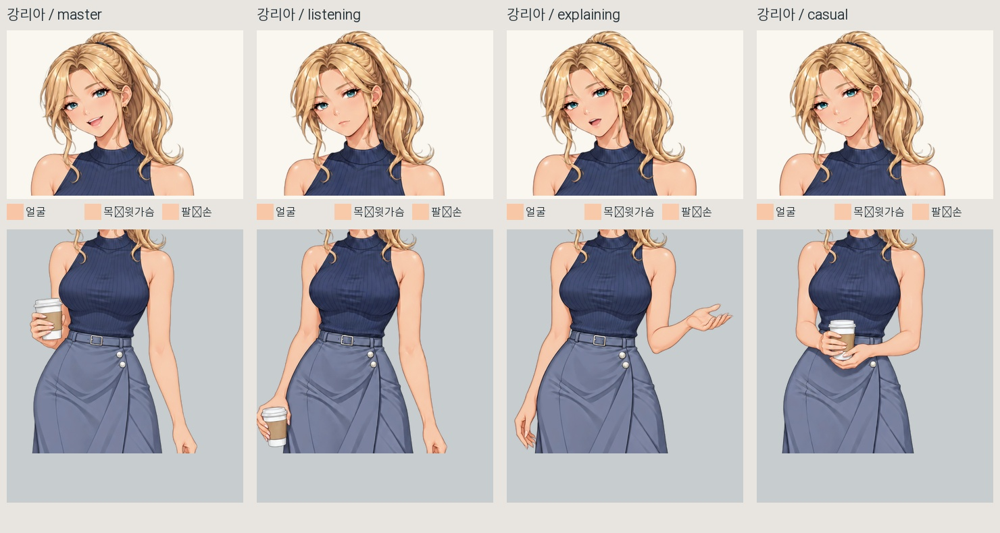
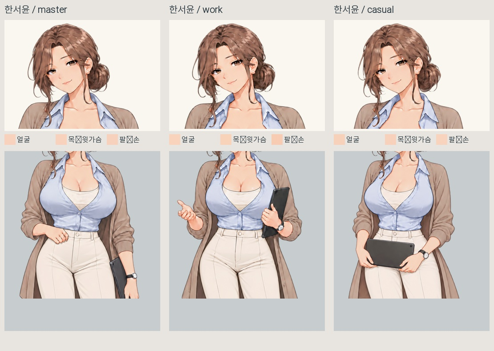
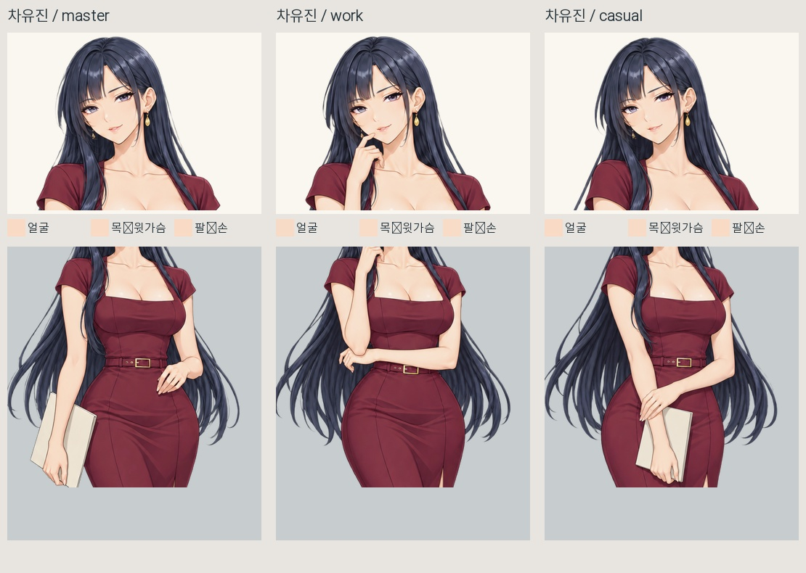
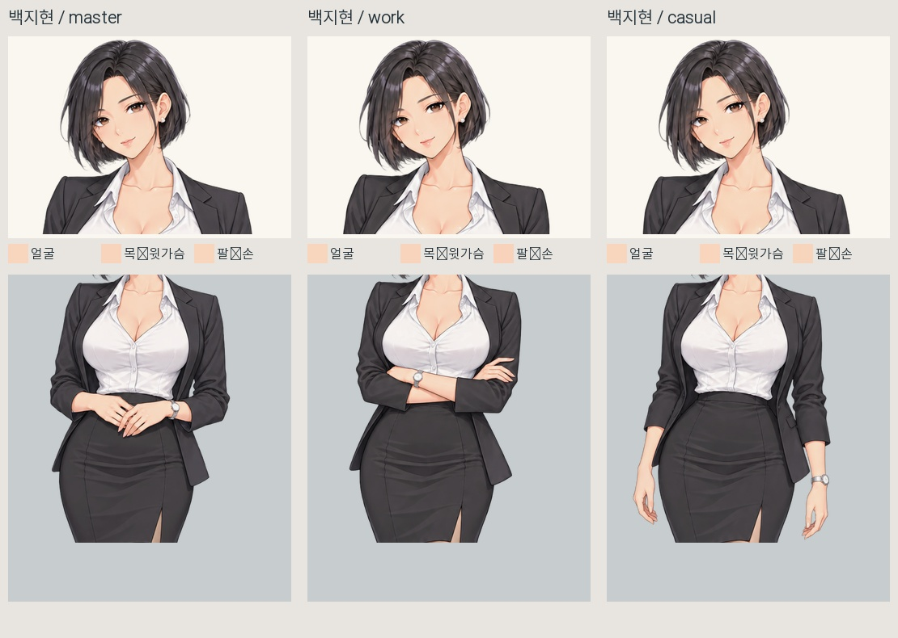

# 전체 히로인 포즈 피부색 재검수

2026-10-07. 새 서윤 MASTER와 태블릿 포즈를 교체·업스케일한 뒤, 현재 게임에 적용된 네 MASTER와 아홉 포즈, 총 13장을 다시 확인했습니다. 이 검수에서는 원화나 보정값을 추가로 변경하지 않았습니다.

## 결론

**모든 포즈의 피부색이 픽셀 단위로 완전히 동일한 상태는 아닙니다.** 리아·유진·지현은 포즈별 피부톤이 잘 맞고, 새 서윤도 얼굴과 목은 잘 맞습니다. 다만 **서윤 설명(work) 포즈의 팔·손은 다른 두 포즈보다 조금 더 진하고 채도가 높은 따뜻한 피부톤이 남아 있습니다.**

네 히로인끼리의 기본 피부색도 하나로 강제하지 않았습니다. 각자의 MASTER에 맞춘 상태라 리아는 상대적으로 따뜻한 살구빛, 유진은 조금 더 밝은 피부톤이고 서윤·지현은 그 사이의 톤입니다. ‘같은 캐릭터가 포즈를 바꿀 때의 일관성’과 ‘네 캐릭터 모두 정확히 같은 피부색’을 구분해서 검사했습니다.

| 캐릭터 | 얼굴·목 | 팔·손 | 판단 |
|---|---|---|---|
| 리아 | 잘 맞음 | 잘 맞음 | 포즈 전환의 큰 피부색 튐 없음 |
| 서윤 | 잘 맞음 | 설명 포즈가 조금 더 진하고 채도 높음 | 손·팔 부분 미세 차이 남음 |
| 유진 | 잘 맞음 | 잘 맞음 | 포즈 전환의 큰 피부색 튐 없음 |
| 지현 | 잘 맞음 | 잘 맞음 | 포즈 전환의 큰 피부색 튐 없음 |

얼굴의 눈 주변에 별도 피부 패치가 덧씌워져 생긴 경계나 턱 분리 현상은 보이지 않았습니다. 얼굴·목·팔에서 자연스러운 그림자와 하이라이트는 있으며, 이를 모두 같은 단색으로 지우는 방식으로 검사하거나 보정하지 않았습니다.

## 서윤 손 표본 추가 확인

옷이나 배경이 표본에 섞인 가능성을 줄이려고 손/팔 창을 좁혀 한 번 더 확인했습니다. 대표 밝음~중간톤 피부 표본은 다음과 같습니다.

| 포즈 | 좁은 피부 표본 RGB 중앙값 예시 |
|---|---|
| MASTER | 248, 210, 188 |
| 설명 work | 248, 201, 176 |
| 태블릿 낮게 들기 casual | 248, 212, 190 |

따라서 서윤의 설명 손 차이는 넓은 창에 옷이 섞여 생긴 값만으로 설명되지는 않습니다. 다만 손의 위치·면 방향·채색 명암도 달라서, 숫자만으로 피부색 오류와 자연스러운 그림자를 완전히 분리할 수는 없습니다. 비교 이미지에서도 손이 조금 더 따뜻하게 읽히므로 미세하게 맞출 후보로 표시했습니다. 현재 얼굴이 틀어지거나 크게 변색된 문제로 판단하지는 않았습니다.

## 검사 방법과 범위

- 현재 게임 렌더러의 색 보정을 켠 상태로 13장을 실제 네이티브 렌더링.
- 동일 카메라에서 일반/확대 화면 26장 확보. 비교 시 카메라·포즈 이동을 끄고 같은 중립 배경에 배치.
- 고정 얼굴/목 창과 포즈별 노출 팔·손 창에서 밝음~중간 피부색 표본을 추출하고 시각 확인.
- 표본 중앙값 범위는 리아 최대 2/255, 유진·지현 최대 3/255, 서윤 얼굴·목 최대 2/255. 서윤 팔·손의 넓은 창 범위는 최대 11/255이며 좁은 손 창에서도 차이 확인.
- 표본은 피부 영역을 완벽하게 분할한 검사나 지각적 색 차이 표준 측정이 아닙니다. 숫자는 참고값이고 빛·그림자·노출 영역의 영향을 받습니다. 본래 그림에 색을 바르기 위한 마스크로 사용하지 않았습니다.
- 게임 상태·표시 검사 41개 통과. 앞선 서윤 교체 검사 26개도 통과했습니다. 전체 게임의 모든 분기 테스트를 다시 실행했다는 뜻은 아닙니다.
- 현재 적용된 서윤 MASTER와 두 포즈는 모두 2048×3070 업스케일본입니다. 다른 히로인의 기존 업스케일본도 유지됩니다.

## 비교 사진

### 강리아

### 한서윤

### 차유진

### 백지현

[전체 표본과 검사 기록](../../샘플/전체히로인_피부색재검수_20261007/피부색표본과비교.json) · [서윤 손 추가 표본](../../샘플/전체히로인_피부색재검수_20261007/서윤_손표본_추가검수.json)

[서윤 새 MASTER·태블릿 포즈 적용 및 생성 프롬프트](서윤전면재설계_적용_20261007.md)
