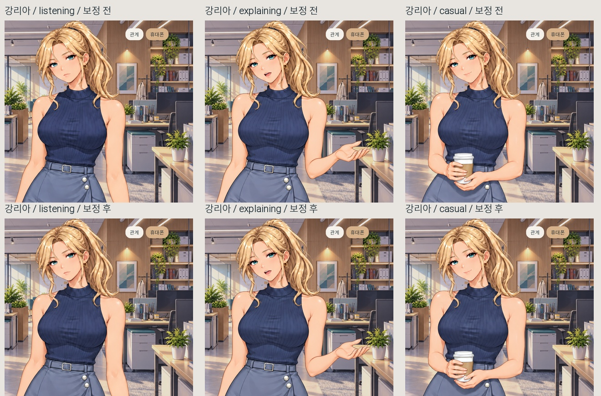
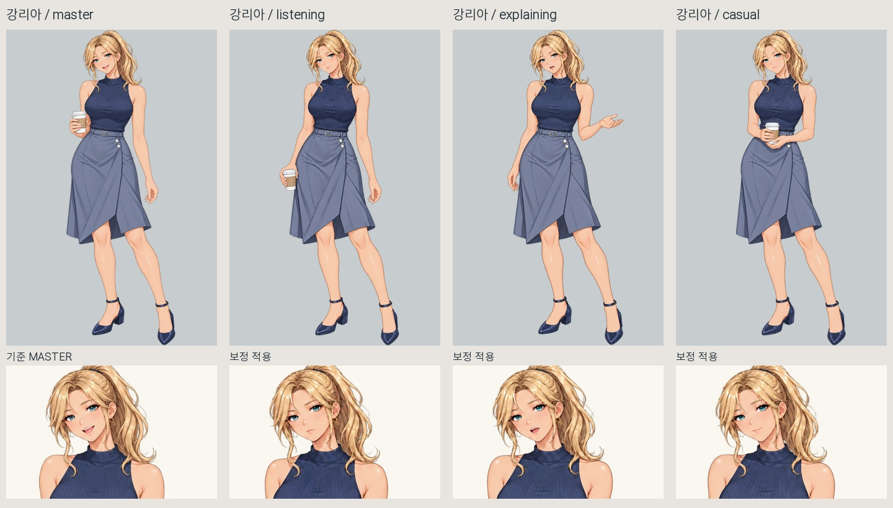
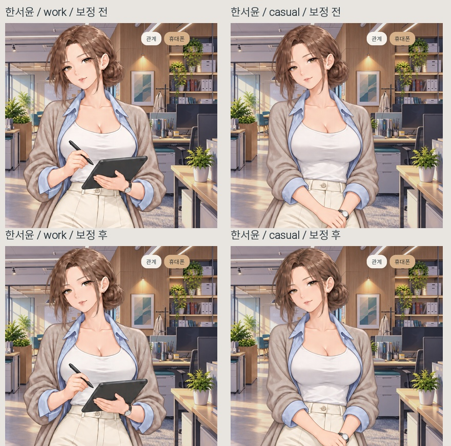
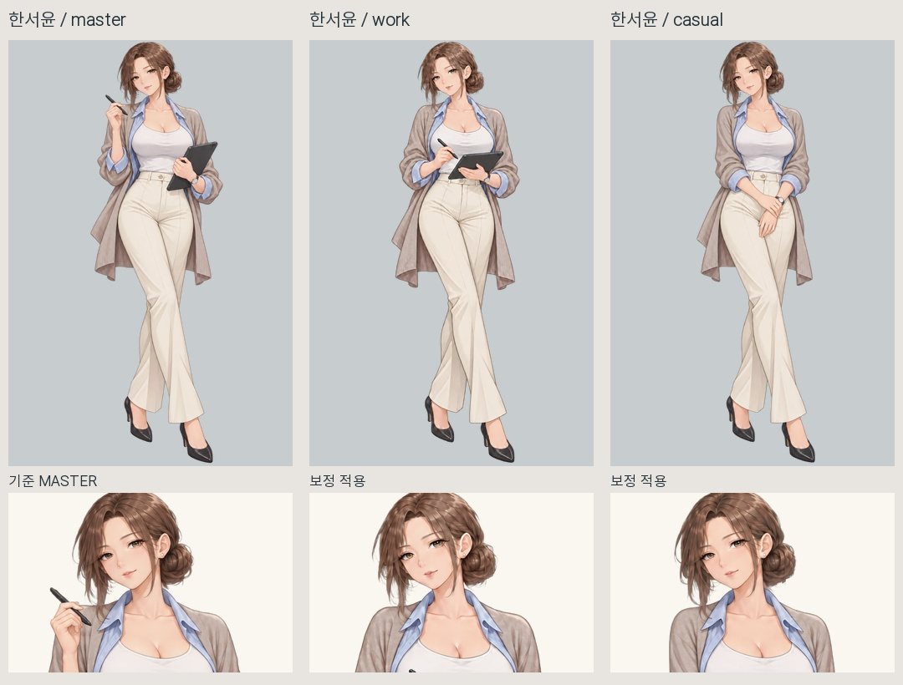
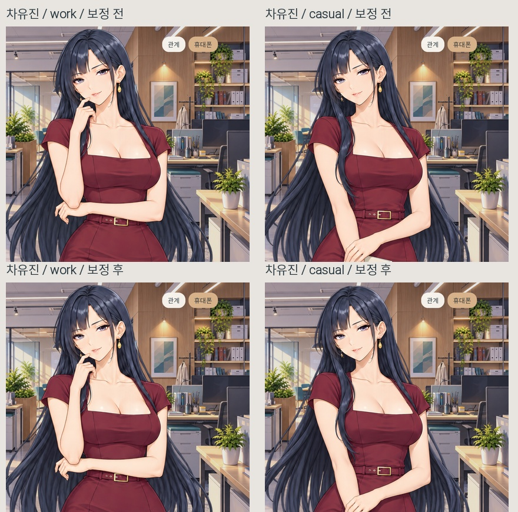
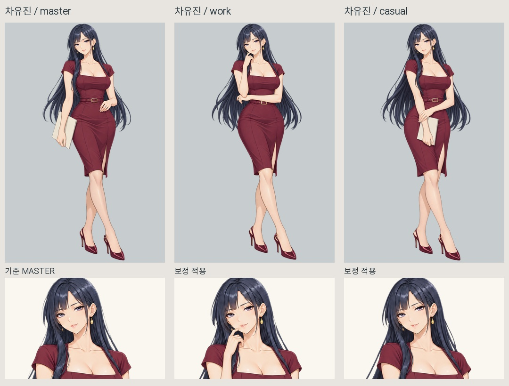
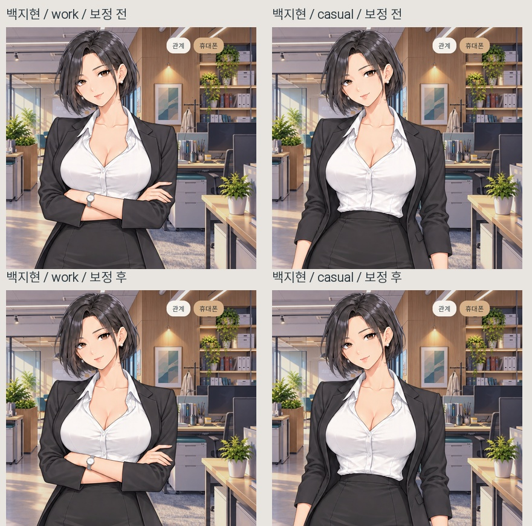
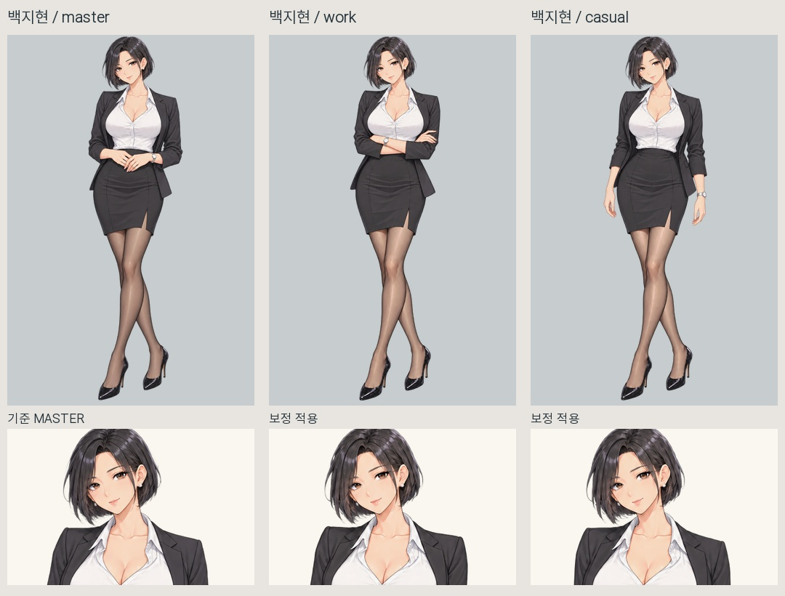

# 히로인 포즈 색감 통일 적용

2026-10-07. 네 히로인의 현재 인게임 9개 포즈에 색감 보정을 적용했습니다.

각 캐릭터의 확정 MASTER가 자기 포즈의 기준입니다. 피부·머리·의상에 쓰인 색을 함께 맞추며, 캐릭터마다 다른 고유 팔레트는 유지합니다.

## 결과

- 리아 3종, 서윤 2종, 유진 2종, 지현 2종에 동일한 보정 체계를 적용했습니다.
- 원화 재생성이나 눈·입 합성을 하지 않았습니다. 기존 포즈, 손가락 수정, 의상 형태, 업스케일 원본은 그대로입니다.
- 게임이 포즈를 표시할 때 부드러운 색 보정만 적용합니다. 같은 색은 얼굴이든 팔이든 같은 방식으로 보정되므로, 사각형 얼굴 패치나 눈 주변만 다른 피부색이 되는 방식을 사용하지 않습니다.
- 원본 MASTER 4장은 기준으로 보존하고 보정을 걸지 않습니다. 모든 캐릭터 PNG 및 리아 셀카, 스토리 파일은 작업 전후 해시가 일치합니다.
- 저장·불러오기 및 포즈 전환에도 보정된 색이 유지됩니다. 기존 저장 데이터에 새로운 필수 변수를 추가하지 않았습니다.

## 검수

원화 기준 13장의 보정 전후 네이티브 렌더를 비교했습니다. 투명도 채널과 이미지 크기는 모두 정확히 같았습니다. 즉 머리·턱·옷·손의 윤곽 위치를 바꾸지 않았습니다. 실제 불투명 픽셀의 색 변화는 채널별 최대 5~9/255로 제한된 작은 보정입니다.

인게임 기능 검사 48개, 동일 카메라 비교 검사 19개, 문법 검사가 통과했습니다. 보정 전후 확대 비교는 카메라 이동과 포즈 전환을 멈춘 동일 구도에서 다시 촬영했습니다.

9개 포즈 모두 MASTER 팔레트와의 표본 색 차이가 감소했습니다. 이 측정은 그림의 대표색 중앙값 비교이며, 사람의 지각이나 소재별 모든 픽셀의 일치를 보장하는 값은 아닙니다. 자연스러운 하이라이트·그림자·주름은 남아 있습니다. 포즈별 얼굴 윤곽이나 옷 질감의 그림 자체를 수정한 작업과는 구분합니다.

| 캐릭터 | 적용 포즈 | 검수 결과 |
|---|---|---|
| 리아 | 듣기·설명·두 손 커피 | 피부/금발/남색 상의/회청색 치마의 색 튐 완화 |
| 서윤 | 태블릿 설명·편한 대화 | 피부/갈색 머리/베이지 가디건/아이보리 의상의 색 튐 완화 |
| 유진 | 생각하며 대화·폴더 내려 들기 | 피부/흑청색 머리/와인색 드레스의 색 튐 완화 |
| 지현 | 기존 팔짱·팔 내린 대화 | 현재 포즈 유지하며 피부/검정 재킷/흰 블라우스의 색 튐 완화 |

## 보존 및 구현

원본 이미지 파일은 손대지 않고 표시 단계의 색 보정으로 적용했습니다. 새 보정 코드는 `game/ui_character_palette.rpy`, 보정값은 `game/ui_pose_palette.json`, 호출 연결은 `game/ui_character_expressions.rpy`입니다. 잘못된 이목구비 합성 파이프라인과 PNG 눈 깜빡임은 계속 꺼져 있습니다.

RGB 색 공간에서 각 MASTER의 대표색을 추출하고, 포즈의 대응 색을 부드럽게 이동시키는 방식입니다. 픽셀 위치를 기준으로 피부를 잘라 붙이지 않습니다. 검정 선/아주 어두운 부분의 보정은 억제하고 색 이동량은 제한했습니다. 기존의 원화 보존 테스트는 이번에 의도적으로 추가된 색 보정 단계를 잠시 우회해 이목구비 원화가 그대로 쓰이는지 확인하도록 갱신했고, 색 보정 자체는 별도의 새 검수로 확인했습니다.

현재 Windows 네이티브 렌더러에서 검수했습니다. 새 Mac 환경에서 실행하면 그 환경에서도 화면 확인이 필요합니다. 구현은 [Ren’Py 공식 모델 렌더링 안내](https://www.renpy.org/doc/html/model.html)의 사용자 셰이더/Transform 방식에 따릅니다.

백업: C:\Users\user\Desktop\건\오피스\변경백업\20261007_포즈색감통일

## 전후 비교

각 이미지의 위쪽은 보정 전, 아래쪽은 보정 후입니다. 얼굴·몸 크기를 따로 정규화하지 않았고 카메라가 고정된 같은 영역을 사용했습니다.

### 강리아

### 한서윤

### 차유진

### 백지현

정확한 보정값·측정·원본 보존 해시는 [보정기준과측정.json](../../샘플/포즈색감통일_20261007/보정기준과측정.json)에 기록했습니다.
