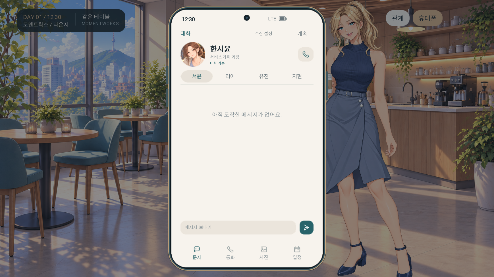
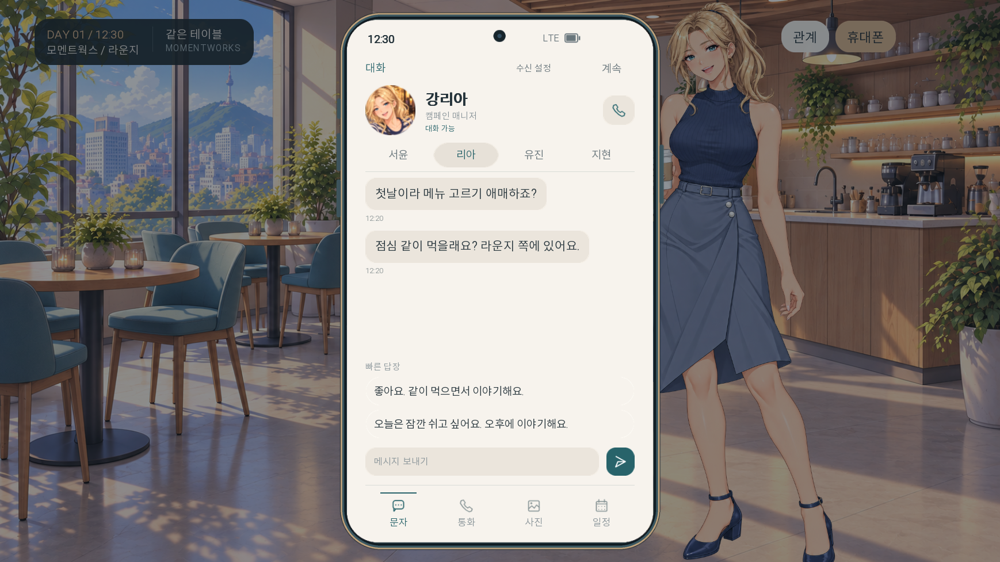
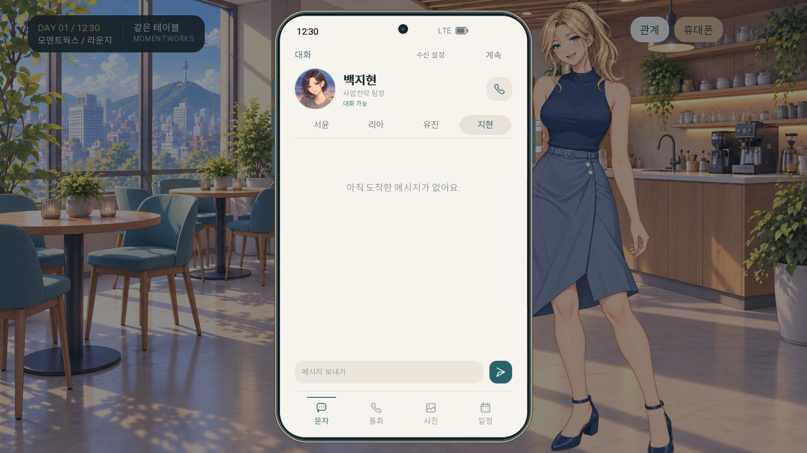

# 사용자 제공 메신저 프로필

2026-10-01. MASTER와 눈매·얼굴 윤곽·눈 색·헤어·귀걸이를 시각 비교해 네 장 모두 같은 캐릭터의 사복 사진으로 적용 가능하다고 판단했다. 픽셀 동일성이나 객관적 얼굴 일치율을 뜻하지 않는다.

- 유진: 긴 남청색 머리, 앞머리, 보랏빛 회색 눈, 금색 물방울 귀걸이 일치. 전시장에서 돌아보는 자세와 사복.
- 지현: 갈색 눈, 턱선 단발과 옆 가르마, 작은 둥근 귀걸이 및 은색 시계 일치. 야외 조명에서 머리가 조금 따뜻하게 보임.
- 리아: 푸른 눈, 높은 금발 웨이브 포니테일, 금색 후프 귀걸이와 열린 미소 일치. 줄무늬 티셔츠 사복.
- 서윤: 갈색 눈, 낮은 갈색 번, 잔머리, 작은 둥근 귀걸이와 차분한 눈매 일치. 가디건 사복. 사진에 시계가 안 보이는 것은 구도에 따른 미확인이지 삭제 설정이 아니다.

사용자 제공 원본을 수정 없이 보관한다. 게임 내부 원형 표시에서만 얼굴 중심으로 Crop한다. 게임 메신저와 수신 통화의 아바타에 적용하며 기존 96 크기를 유지한다. 전신 MASTER 및 관계 패널은 그대로 유지한다. 파일별 크기와 표시 영역, 해시는 manifest.json에 기록했다.

## 실제 게임 적용 확인

연락처 네 명을 전환해 원형 크롭과 96 크기, 통화 프로필 표시를 확인했다. Ren’Py 문법 검사와 실제 UI 시나리오 검사를 통과했다.

