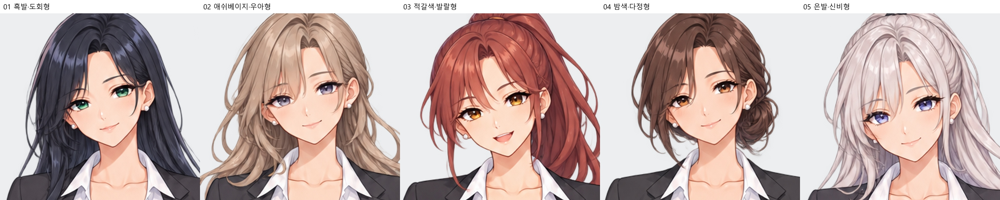
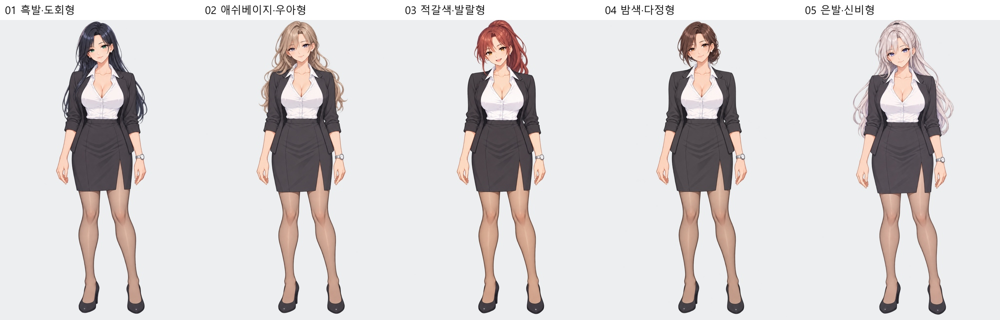

# 백지현 외형 예시 5종

얼굴·헤어스타일을 새로 설계한 후보 5개입니다. 기존 게임 그림체와 정장·체형을 기준으로 제작했습니다.

|번호|방향|얼굴|전신|투명 PNG|
|---|---|---|---|---|
|01|흑발·도회형|[확대](01_흑발·도회형_얼굴.jpg)|[전신](01_흑발·도회형_전신.jpg)|[PNG](01_흑발·도회형.png)|
|02|애쉬베이지·우아형|[확대](02_애쉬베이지·우아형_얼굴.jpg)|[전신](02_애쉬베이지·우아형_전신.jpg)|[PNG](02_애쉬베이지·우아형.png)|
|03|적갈색·발랄형|[확대](03_적갈색·발랄형_얼굴.jpg)|[전신](03_적갈색·발랄형_전신.jpg)|[PNG](03_적갈색·발랄형.png)|
|04|밤색·다정형|[확대](04_밤색·다정형_얼굴.jpg)|[전신](04_밤색·다정형_전신.jpg)|[PNG](04_밤색·다정형.png)|
|05|은발·신비형|[확대](05_은발·신비형_얼굴.jpg)|[전신](05_은발·신비형_전신.jpg)|[PNG](05_은발·신비형.png)|

내장 image_gen 사용. [실제 제작 프롬프트](제작프롬프트.json). 선택용 예시이며 게임용 마스터 교체는 적용하지 않았습니다. 확대 미리보기는 원본 크롭·리샘플링입니다.
