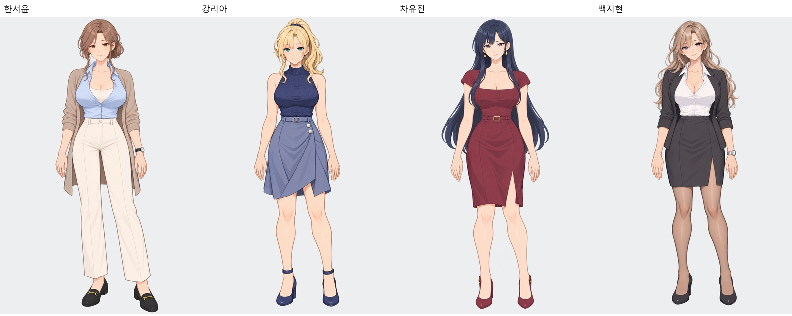
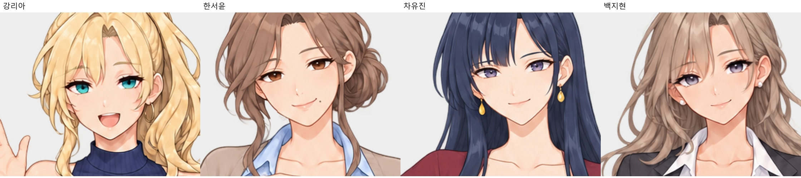
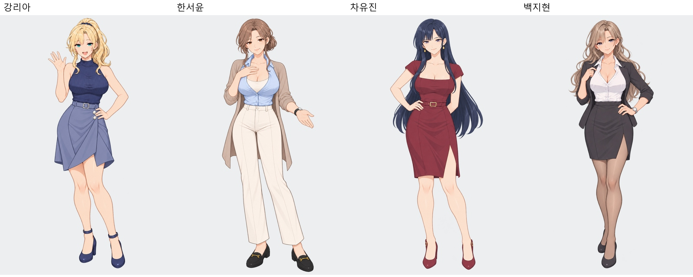

# 전체 히로인 이미지 검수

2026-10-11: 원화 46장·2배 확대본 46장 전체를 확인했습니다. 백지현은 선택된 2번 애쉬베이지 외형을 적용했습니다. 내려놓은 손의 손가락/손톱을 정리했고 유진 한쪽 귀걸이를 단일 물방울 형태로 복원했습니다.

|인물|전체 전신|전체 얼굴|손|대표 확대|
|---|---|---|---|---|
|강리아|[전신](강리아/모든전신.jpg)|[얼굴](강리아/모든얼굴.jpg)|[손](강리아/손확대.png) · [마스터 손](강리아/마스터손확대.png)|[대표](강리아/대표확대.jpg)|
|한서윤|[전신](한서윤/모든전신.jpg)|[얼굴](한서윤/모든얼굴.jpg)|[손](한서윤/손확대.png) · [마스터 손](한서윤/마스터손확대.png)|[대표](한서윤/대표확대.jpg)|
|차유진|[전신](차유진/모든전신.jpg)|[얼굴](차유진/모든얼굴.jpg)|[손](차유진/손확대.png) · [마스터 손](차유진/마스터손확대.png)|[대표](차유진/대표확대.jpg)|
|백지현|[전신](백지현/모든전신.jpg)|[얼굴](백지현/모든얼굴.jpg)|[손](백지현/손확대.png) · [마스터 손](백지현/마스터손확대.png)|[대표](백지현/대표확대.jpg)|

대략 7~8등신의 성인 미연시 비율입니다. 목·어깨·팔·무릎·발목·발 크기의 연결을 전신으로 비교했습니다. 개별 결과는 각 인물 폴더의 검수결과 JSON과 히로인/인물이름/검수자료에 저장했습니다. 내장 image_gen 사용. 실제 플레이 테스트는 하지 않았습니다.
