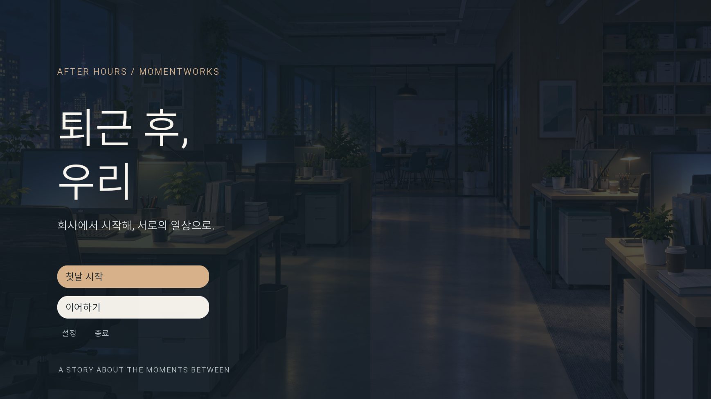
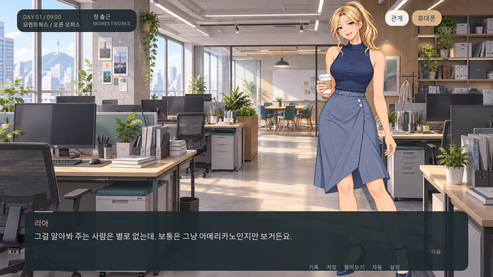
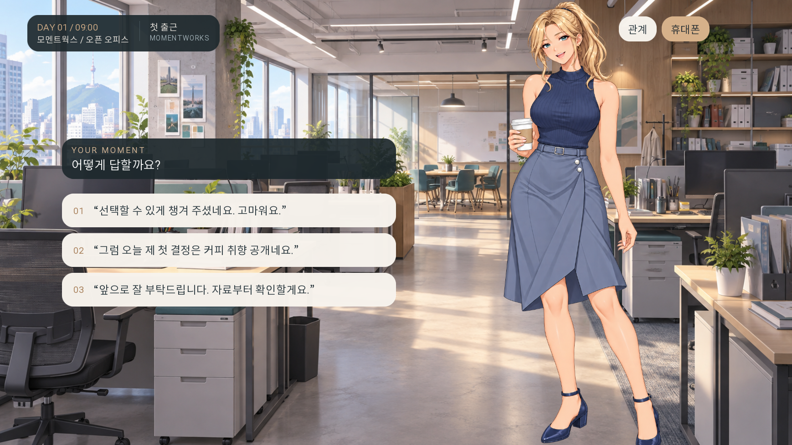
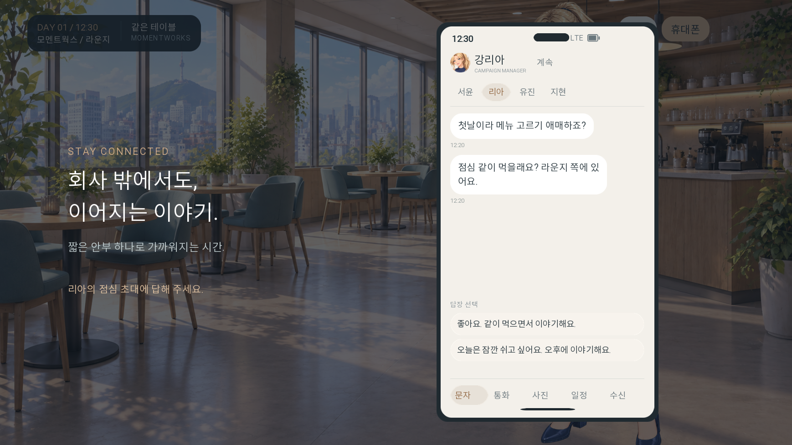
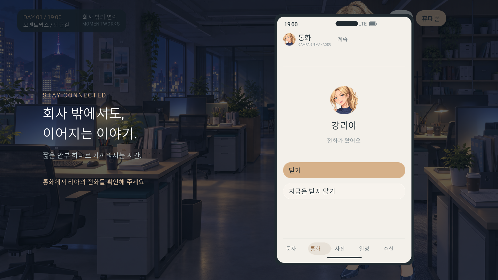
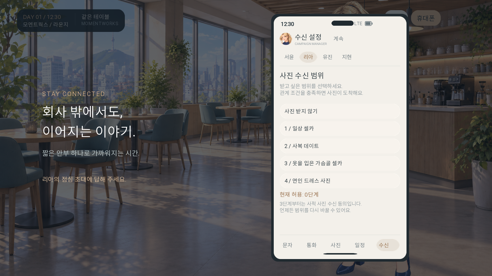
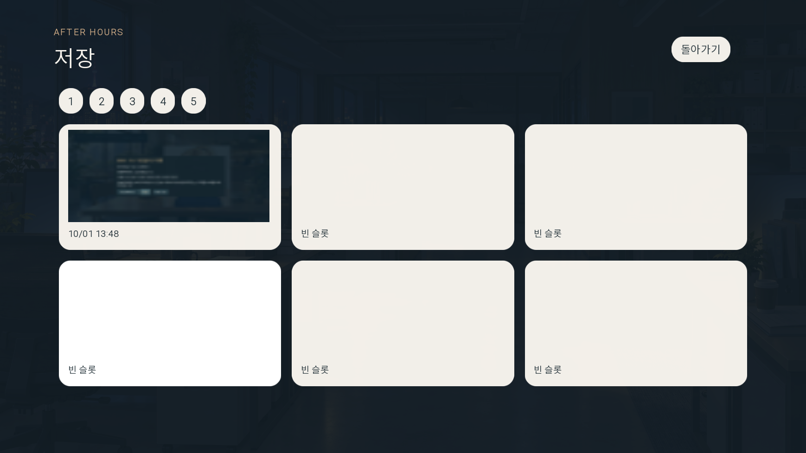
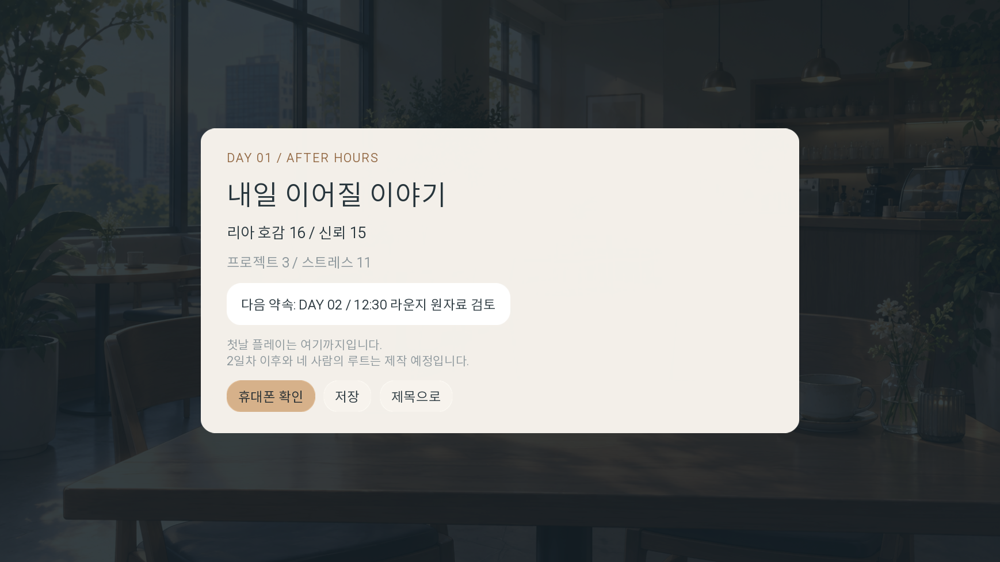

# UI 시안 v2 — 퇴근 후, 우리

2026-10-01. Ren’Py 실제 실행 화면을 캡처한 시안입니다. 현재 게임에도 적용되어 있습니다. `RenPy_게임시작.bat`로 직접 확인할 수 있습니다.

아이보리·차콜·샴페인 포인트, 둥근 패널, 얼굴을 가리지 않는 선택지, 실제 기기 형태의 휴대폰이 기준입니다. 캐릭터 원화는 새로 만들거나 편집하지 않았습니다.

## 타이틀

## 대화

## 선택지

## 문자

## 수신전화

## 사진수신설정

## 저장

## 하루결과

## 구현 범위

대사창·선택지·HUD·문자·전화·사진·일정·수신 설정·관계·저장/불러오기·기록·설정·결과 화면의 스타일을 맞췄습니다. 4인의 승인 MASTER를 화자에 맞춰 표시하며 폰 프로필은 원본의 얼굴 부분을 화면 안에서 크롭합니다. 기존 수치·대사·조건·보상은 유지했습니다.

새 UI는 짧은 진입 효과를 사용하며 움직임 줄이기에서 즉시 표시합니다. 캐릭터는 현재 MASTER 정지 스탠딩입니다. 독립 눈/입 레이어 애니메이션과 새로운 표정 제작은 별도 작업입니다. 단계 메시지 사진은 계속 미제작 상태입니다.
