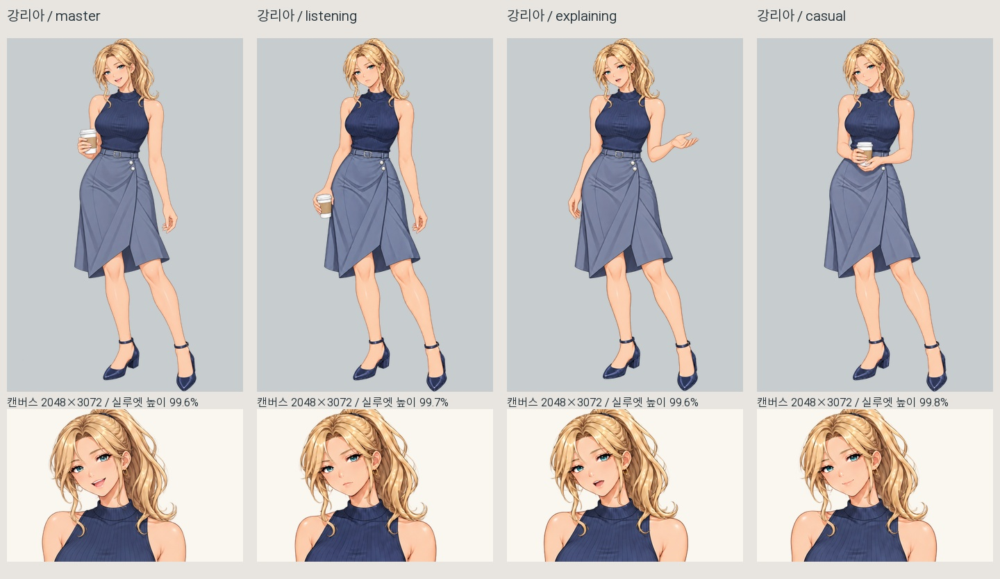
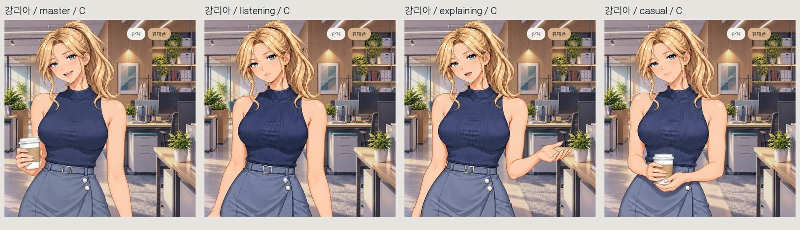
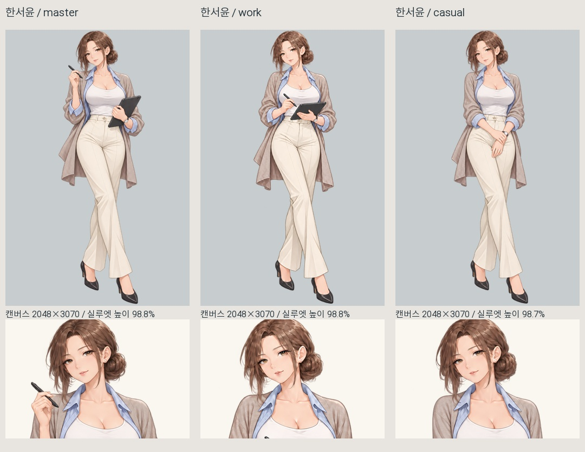
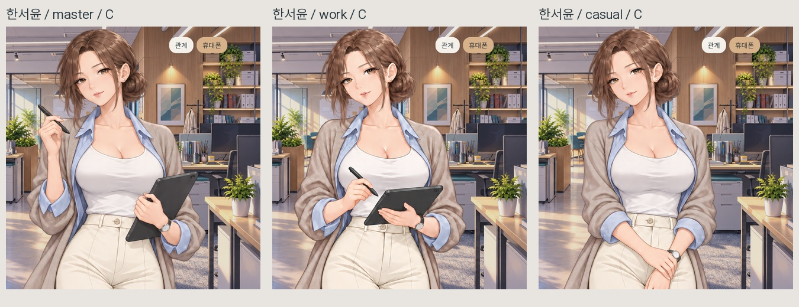
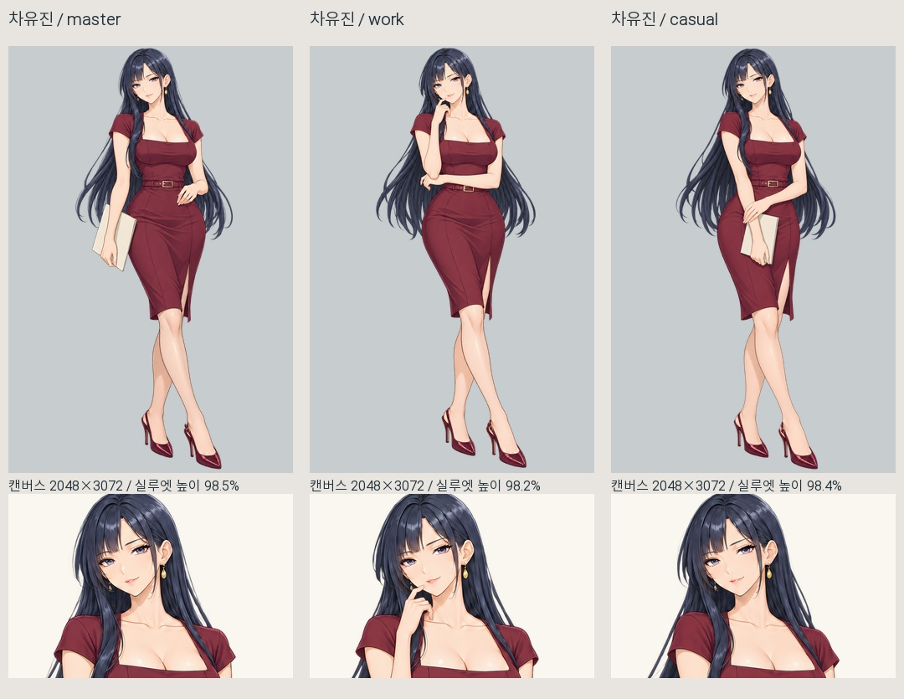
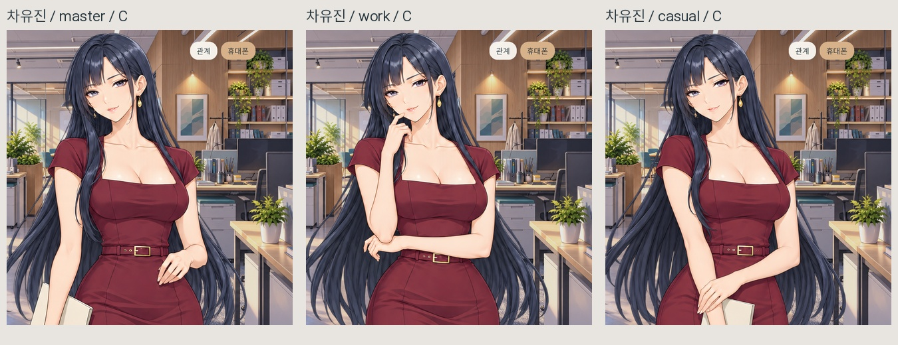
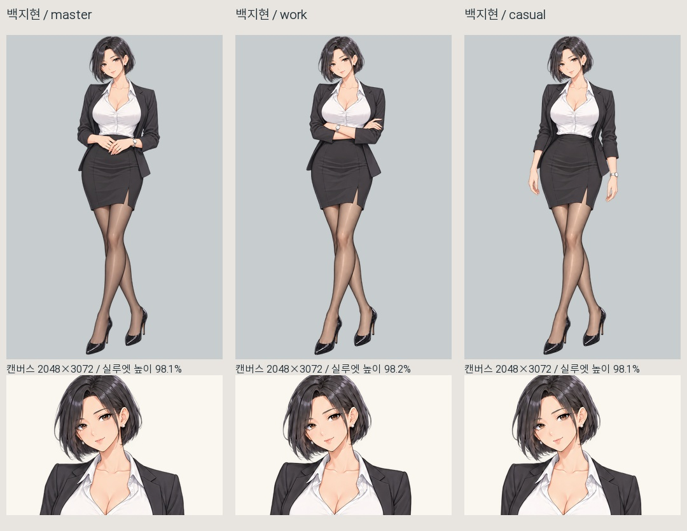
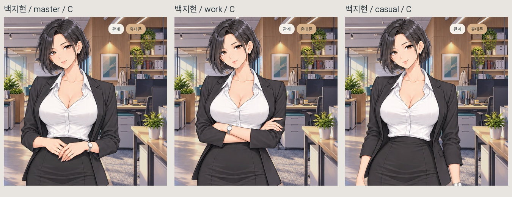
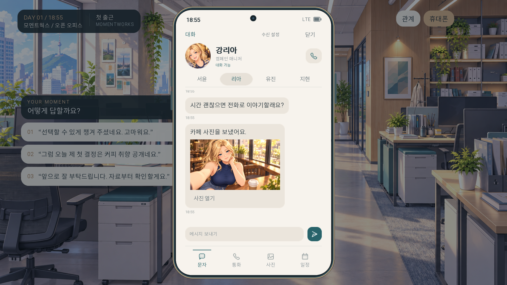

> 후속 상태: 2026-10-07에 히로인 9개 포즈의 색감을 MASTER 기준으로 보정했습니다. 이미지 파일은 보존하고 화면 표시 색만 맞췄습니다. 아래 내용은 색 보정 전 검수 기록이며 현재 상태는 [색감 통일 적용 문서](C:/Users/user/Desktop/건/오피스/RenPy_게임/히로인포즈_색감통일_적용_20261007.md)를 참고하세요.

# 리아 셀카·유진 포즈 적용과 색감·크기 검수

2026-10-07. 리아 창가 셀카 A와 유진 두 포즈를 적용했습니다. 지현은 기존 인게임 이미지 그대로입니다.

## 적용

- 리아: `ria_cafe` 사진 토큰은 유지하고 연결된 이미지 파일을 창가 셀카 A로 교체. 기존 저장·앨범 기록에도 새 사진이 표시됩니다. 문자 썸네일, 앨범, 사진 확대 모두 확인.
- 유진 업무 포즈(work): B, 턱에 손을 가볍게 댄 생각하는 자세.
- 유진 편한 대화 포즈(casual): A, 폴더를 낮게 들고 듣는 자세. 기존 “이 폴더까지만 정리하고 갈게요” 대사에도 어울리는 쪽으로 배치.
- 유진 두 장은 기존과 동일하게 2048×3072로 업스케일. 원화 확대 60% + Real-ESRGAN general 보정 40%, 원화 알파 보존. 별도 피부·의상 색 보정이나 이목구비 합성은 하지 않음.
- 게임의 이미지 3장만 교체. 지현 3장, 다른 히로인의 스프라이트, 스토리·휴대폰 진행 코드의 해시는 작업 전후 일치. 원본은 변경백업 폴더에 보존.

## 판단

포즈 전환에서 느끼는 불일치는 완전히 없지는 않습니다. 다만 현재 파일들을 같은 배경·같은 캔버스·같은 카메라에서 비교하면, 피부/의상 기준색이 크게 바뀌거나 전체 키가 크게 뛰는 문제보다는 **얼굴의 작은 형태 차이와 피부·옷의 명암/주름 차이**가 남아 있습니다. 실제 장면에서 B→C가 함께 발생하면 1.5배 확대가 더 큰 크기 변화로 보입니다.

| 캐릭터 | 피부·의상 관찰 | 크기·형태 관찰 | 우선순위 |
|---|---|---|---|
| 리아 | 남색 상의·회청색 치마는 대체로 일관적. 설명/편한 포즈에서 피부 하이라이트와 상의 음영이 조금 밝게 보임 | 얼굴·표정과 어깨 윤곽에 작은 차이. 전체 높이는 안정적 | 낮음 |
| 서윤 | 베이지 가디건·하늘색 셔츠·아이보리 바지는 같은 계열. 가디건 결·접힘과 얼굴 음영은 포즈별로 다름 | 업무 포즈의 얼굴이 기준보다 약간 좁아 보임. 전체 키의 변화는 거의 없음 | 얼굴 폭·옷 질감 우선 확인 |
| 유진 | 새 두 포즈의 피부·와인색 의상은 대체로 맞음. 팔 위치에 따라 허리·가슴 주변 드레스 명암과 주름 대비가 달라짐 | 턱/얼굴 윤곽에 미세한 변화, 전체 높이는 안정적 | 새 포즈의 드레스 명암과 얼굴 윤곽 확인 |
| 지현 | 검정 재킷·흰 블라우스 색은 안정적. 팔짱/팔 내린 자세에서 재킷과 블라우스 명암·접힘이 달라짐 | 팔 위치에 따른 상체 실루엣 변화가 있음. 전체 높이는 안정적 | 현재 모습 유지 |

위 관찰은 MASTER + 인게임 9개 포즈, 총 13장과 일반/확대 구도에서 비교한 결과입니다. 각 그림의 자연스러운 자세 차이와 재생성으로 인한 형태 차이가 섞여 있으므로 실루엣 너비 차이를 모두 체형 오류로 판단하지 않았습니다. 모든 포즈의 피부·옷 색이 픽셀 단위로 같다는 뜻은 아닙니다.

## 수치와 해석

같은 캐릭터의 불투명 실루엣 높이 범위는 리아 0.19, 서윤 0.06, 유진 0.30, 지현 0.07 퍼센트포인트입니다. 이는 캔버스 높이에 대한 그림 높이의 차이이며, 설정상의 신장이나 얼굴 크기 측정치가 아닙니다. 화면 높이가 1536인 동일 일반 구도에서는 최대 약 4.6픽셀 차이입니다.

고정 얼굴 영역에서 추출한 피부색 표본의 RGB 중앙값 범위는 채널별 최대 3/255 수준으로 작습니다. 다만 표본의 위치·면적·명암이 다르므로 이 수치를 ‘완벽한 색 일치’의 근거로 쓰지는 않았습니다. 의상은 소재·주름·팔에 가려진 면적이 달라 동일 영역 평균색을 기계적으로 일치시키는 것이 적절하지 않아 시각 비교로 판단했습니다.

화면 렌더링 경로에 피부/눈/입 덧씌우기가 없는 것도 확인했습니다. 현재 렌더러와 각 원화 파일을 그대로 표시한 네이티브 렌더를 비교한 13개 결과는 모두 일치했습니다. 따라서 현재 보이는 미세한 차이는 얼굴 합성 패치가 다시 적용되어 생긴 현상은 아닙니다.

추가 수정 시에는 전체에 색 필터를 덮기보다, 서윤 얼굴 폭과 가디건 질감, 유진 드레스 명암처럼 차이가 보이는 부위만 기준 원화에 맞추는 것이 적절합니다. 이 작업에서는 요청한 교체와 검수까지만 완료했고, 네 히로인의 색을 임의로 재보정하지 않았습니다.

## 검증

- 네이티브 게임 검수: 73개 검사 통과. 포즈 표시, 일반/확대 구도, 유진 저장·불러오기, 리아 사진 수신·앨범 저장 포함.
- 같은 구도별 화면 26장, 리아 사진 화면 3장 저장.
- 비교 이미지는 얼굴만 따로 확대·축소하지 않고, 같은 캔버스 또는 같은 화면 영역을 사용.
- 사진 화면과 포즈 화면은 재현 가능한 검수용 상태에서 촬영한 것으로, 실제 스토리 전 구간을 사람처럼 플레이한 검수와는 구분.
- 문법 검사 결과는 적용검증.json 및 게임문법검수.log 참고.

## 비교 자료

### 강리아

### 한서윤

### 차유진

### 백지현

### 리아 문자 사진

백업: C:\Users\user\Desktop\건\오피스\변경백업\20261007_리아셀카_유진포즈교체
