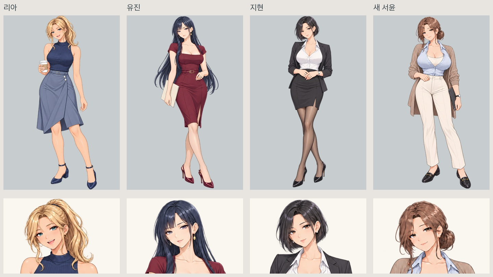
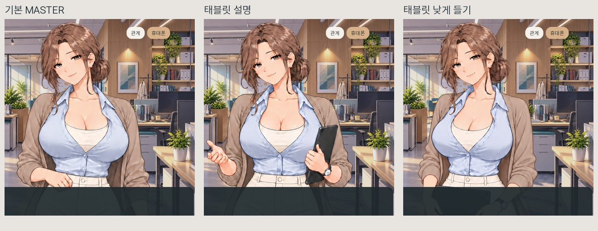

# 서윤 MASTER·포즈 전면 재설계 적용

2026-10-07. 사용자의 전면 교체 지시와 후속 체형·입·소품 수정 요청을 반영했습니다.

## 최종 모습

- 리아·유진·지현 원화를 직접 스타일 참조로 사용해 같은 계열의 선화·눈 표현·머리 채색·피부/옷 명암으로 재설계.
- 성숙한 미시 분위기와 상체 볼륨을 유지. 허리·허벅지는 슬림하게 정리하고 골반만 소폭 보완.
- 세 장 모두 입을 다문 작은 미소. 갈색 낮은 번, 진주 귀걸이, 시계, 하늘색 블라우스/아이보리 이너, 회갈색 가디건, 아이보리 바지, 검정 낮은 굽 로퍼 사용.
- 컵 포즈는 채택하지 않았고 현재 포즈는 전부 태블릿을 사용.

| 자산 | 자세 | 인게임 규격 |
|---|---|---|
| MASTER | 태블릿을 옆에 내려 들기 | 2048×3070 RGBA |
| 업무 work | 태블릿을 세워 들고 낮은 손짓으로 설명 | 2048×3070 RGBA |
| 편한 대화 casual | 태블릿을 양손으로 낮게 들기 | 2048×3070 RGBA |

## 업스케일·색감·크기

**세 장 모두 업스케일을 완료해 게임에 적용했습니다.** 기존 네 히로인의 업스케일본도 유지됩니다. 이 폴더에는 생성 원화, 크기 정규화 원화, 업스케일본을 구분해 보관했습니다.

원화는 1024×1536이고, 기존 서윤 게임 캔버스에 맞춘 정규화 원화는 1024×1535입니다. 그림 전체를 같은 비율로 조금 축소하고 여백만 배치했습니다. 얼굴, 다리, 상체를 따로 늘이거나 눌러서 맞추지 않았습니다. 골반 보완은 내장 image_gen 이미지 수정으로 처리했고 크기 정규화는 배치/리사이즈만 사용했습니다.

다른 히로인과 같은 캔버스에서 나란히 비교했고, 서윤 세 포즈의 실루엣 높이 차이는 캔버스 높이 대비 0.1 퍼센트포인트 미만입니다. 이는 표시 크기 관리값이며 설정상 신장이나 실제 신체 치수 측정값은 아닙니다. 각 포즈의 자연스러운 시선·어깨·손 위치 차이는 남아 있습니다.

업스케일은 Real-ESRGAN general 4배 결과를 2배로 줄여 원화 확대 60%와 보정 40%를 혼합했습니다. 정규화 원화의 알파를 그대로 확대해 넣었습니다. 손·눈·입의 그림을 별도 패치로 합성하지 않았습니다.

방금 완료했던 게임 표시 색 보정은 새 서윤 MASTER를 기준으로 다시 계산했습니다. 다른 세 히로인의 보정값은 그대로입니다. 전체 그림에 부드러운 색 이동만 적용하며 이목구비를 잘라 붙이지 않습니다.

## 적용·검수

- 현재 기준 MASTER 경로: `히로인/한서윤_seoyun_MASTER.png` — 정규화 원화. 게임 경로는 기존 `seoyun_master.png`, `seoyun_poses/work.png`, `seoyun_poses/casual.png`를 유지하고 업스케일 파일로 교체.
- 다른 히로인의 이미지, 리아 셀카, 스토리·휴대폰 진행 코드의 작업 전후 해시가 일치.
- 실제 DAY 2 메시지 응답 후 서윤 대화에 진입해 새 포즈가 표시되는 것을 확인. 일반/확대 구도, 저장·불러오기, 포즈 전환, 휴대폰 표시 시 캐릭터 숨김 포함 26개 검사 통과.
- 원화 렌더와 색 보정 렌더에서 세 그림 모두 이미지 크기·알파 경계 일치. 피부 패치나 PNG 눈 깜빡임은 재활성화하지 않음.
- 캐릭터 MD, MASTER 대응표, 파생 포즈 목록의 현재 시각 기준을 갱신하고 기존 기록은 백업·이력으로 보존.
- ‘유부녀 느낌’은 외형 지시로 반영. 이번 작업에서 실제 결혼 상태·나이·성격·스토리는 바꾸지 않음. 기존 표정 이미지와 휴대폰 프로필은 별도 자산이며 현재 새 스프라이트를 덮어쓰는 용도로 사용하지 않음.
- 이미 실행 중인 게임이 옛 이미지를 캐시하고 있다면 재실행하면 새 자산과 색 보정이 표시됨.

문법 검사 결과는 적용검증.json과 게임문법검수.log에 기록합니다. 현재 Windows 네이티브 게임에서 확인한 결과입니다.

## 비교

내장 image_gen 사용. 정확한 최종 생성 프롬프트와 참조 이미지, 원화/업스케일 경로·지문·보정·정규화 기록은 [생성프롬프트와적용목록.json](C:/Users/user/Desktop/건/오피스/히로인/한서윤_전면재설계_20261007_v1/생성프롬프트와적용목록.json)에 있습니다.

백업: C:\Users\user\Desktop\건\오피스\변경백업\20261007_서윤전면재설계
