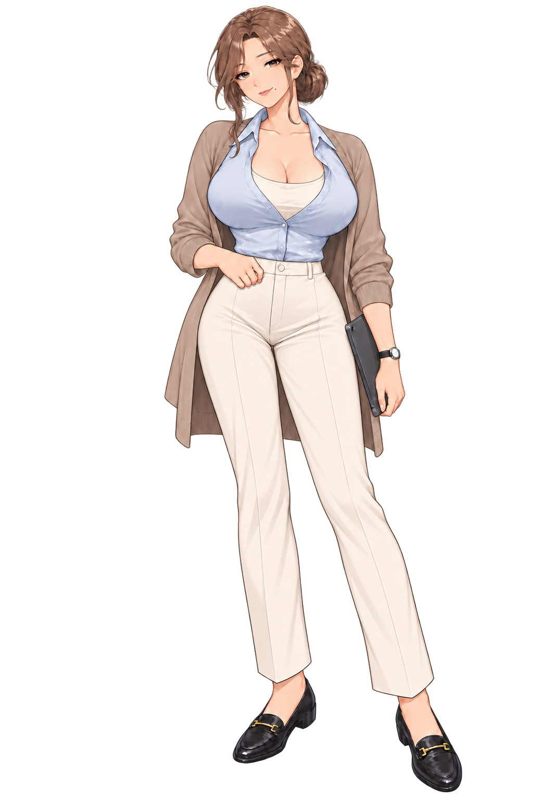
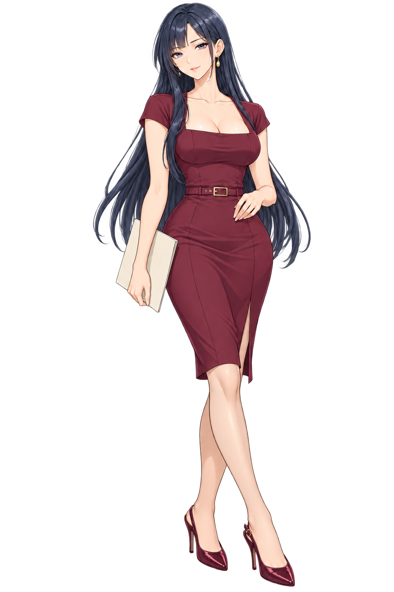

# 히로인 이미지

**이미지 102개 · PNG 77개 / JPG 25개**

캐릭터 이미지는 용도별로, 각 폴더 안에서는 캐릭터별로 정리했습니다. 이미지를 누르면 원본을 열 수 있습니다.

| 한서윤 | 강리아 | 차유진 | 백지현 |
| :---: | :---: | :---: | :---: |
|  |  |  |  |

## 폴더 안내

|폴더|들어 있는 이미지|개수|
|---|---|---:|
|[01_MASTER](01_MASTER/README.md)|승인 MASTER 원화|4|
|[02_포즈](02_포즈/README.md)|업무·캐주얼·설명·듣는 자세|9|
|[03_표정](03_표정/README.md)|포즈별 default·serious|24|
|[04_사복](04_사복/README.md)|원화 16 + 업스케일 16 + 포즈 예시 4|36|
|[05_검수자료](05_검수자료/README.md)|확대·검수 JPG 25 + MASTER 기록 사본 4|29|

## 파일을 고르는 기준

- **기본 인물 이미지:** 01_MASTER
- **자세만 바꾸기:** 02_포즈
- **같은 자세의 표정 바꾸기:** 03_표정의 default(기본) / serious(진지)
- **다른 의상:** 04_사복. 원화는 약 1024×1536, 업스케일은 2048×3072입니다.
- **검수 과정 확인:** 05_검수자료

[이미지 전체 목록](이미지목록.md) · [파일 크기·해시 목록](파일목록.json) · [이전 경로 → 새 경로](경로변경표.json)

2026-10-08 정리. 이미지 102개의 내용·해상도·투명도는 변경하지 않았습니다. 05_검수자료에는 제작 시점의 기록이 포함됩니다. GitHub 폴더 정리이며, 앞서 삭제한 게임용 캐릭터 경로는 현재 연결되어 있지 않습니다.
