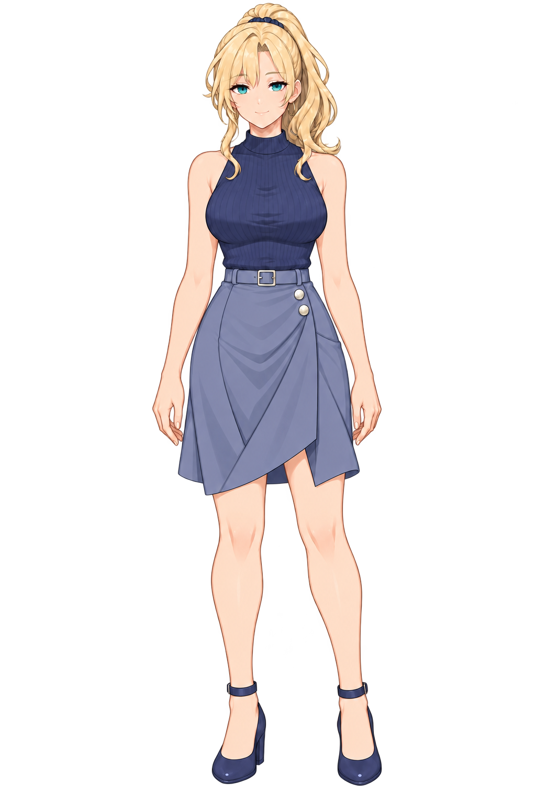
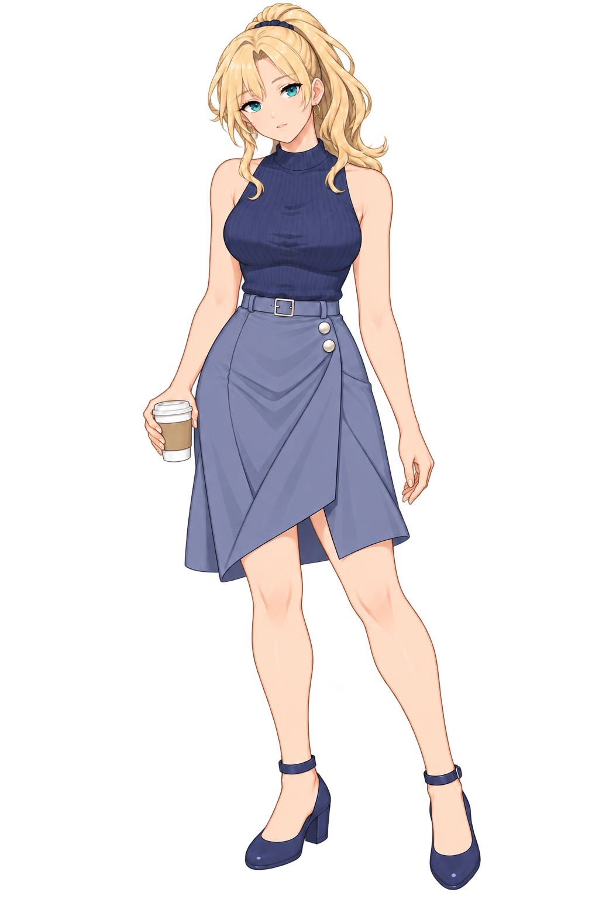
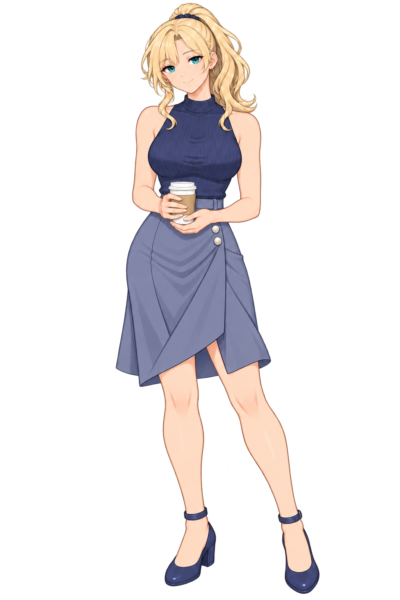
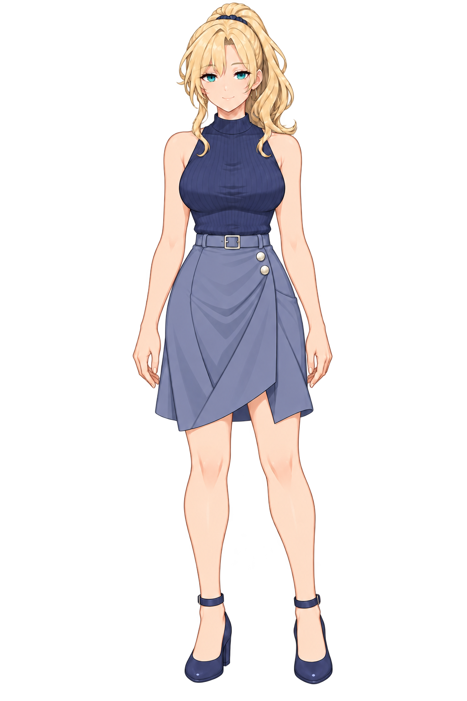
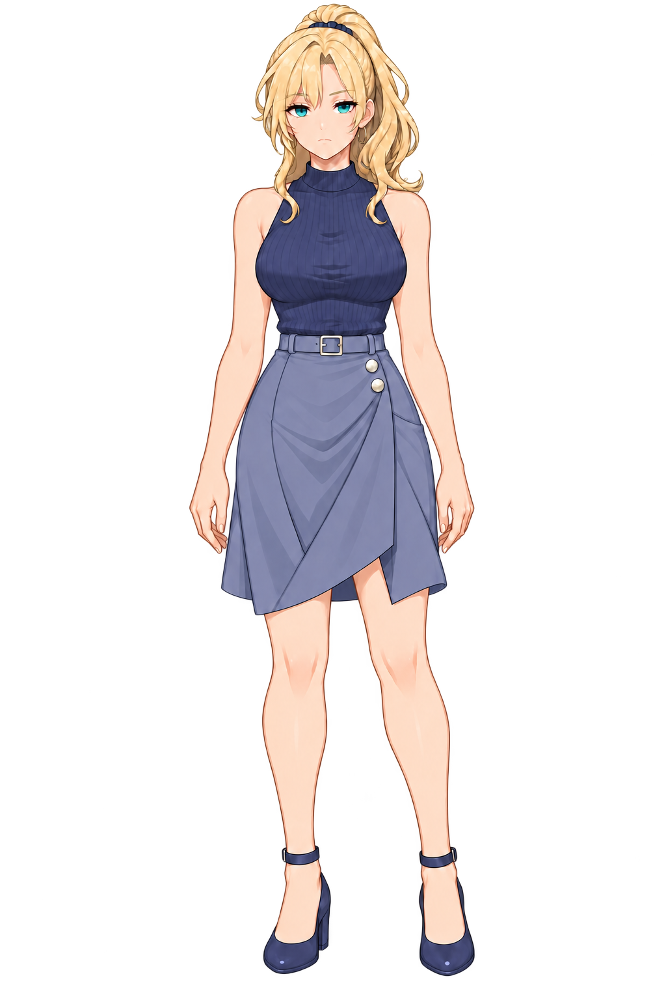
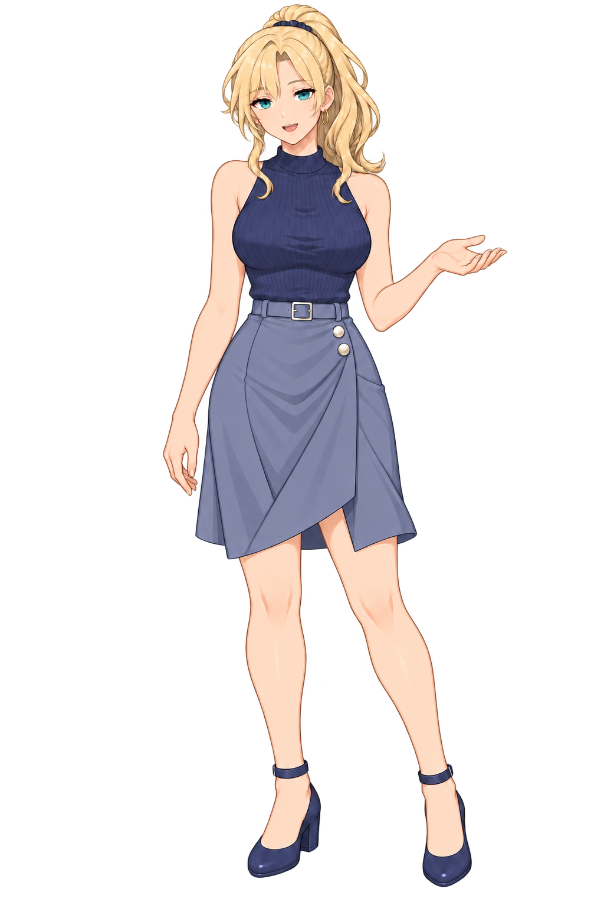
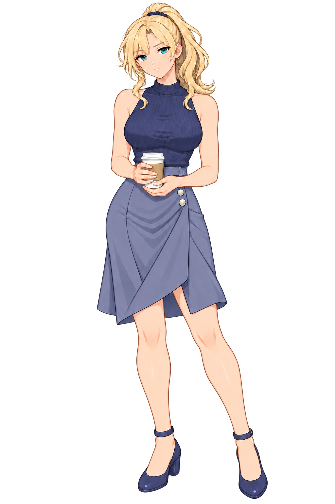

# 강리아

[전체 히로인](../README.md) · **새 작화 이미지 24개**: 원화 10장 · 2배 확대본 10장 · 검수 이미지 4장.

## MASTER

[원화 1024×1536](MASTER.png) · [2배 확대 2048×3072](업스케일/MASTER.png)

승인된 5번 얼굴을 기준으로 정자세와 전신 비율을 다듬었습니다. 얼굴·머리·귀·귀걸이·손·옷·신발은 같은 마스터의 선화·색감·명암을 기준으로 제작했습니다. 귓불의 살색 돌기와 중복 링은 확대 편집으로 제거했습니다.

## 포즈

|듣는 자세|설명|캐주얼|
|:---:|:---:|:---:|
||||
|[2배 확대](업스케일/포즈/듣는자세.png)|[2배 확대](업스케일/포즈/설명.png)|[2배 확대](업스케일/포즈/캐주얼.png)|

## 표정

|포즈|기본|진지|
|---|:---:|:---:|
|MASTER|||
|설명|||
|캐주얼|||

[표정 2배 확대본 폴더](업스케일/표정/)

기본 표정 파일은 MASTER와 해당 포즈의 동일 파일입니다. 진지 표정은 해당 자세의 얼굴 표정만 변경하는 방향으로 제작했습니다. 생성형 편집으로 미세한 형태 차이가 있습니다.

## 확대 검수

[전신 10장](검수자료/전신10장.jpg) · [얼굴 10장](검수자료/얼굴10장.jpg) · [귀걸이 확대](검수자료/귀걸이확대.png) · [손 확대](검수자료/손확대.png) · [검수 기록](검수자료/README.md)

2배 확대는 Lanczos3 리샘플링으로 기존 작화를 유지했습니다. 새 디테일을 임의로 생성하지 않았습니다. 게임용 파일에는 확대본을 연결했고, 이전 작화용 색상 보정을 리아에 적용하지 않도록 했습니다. 이전 사복 이미지와 리아가 포함된 이전 비교 이미지는 현재 저장소에서 제거했습니다.
