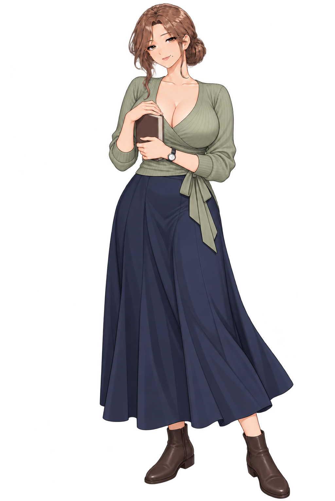
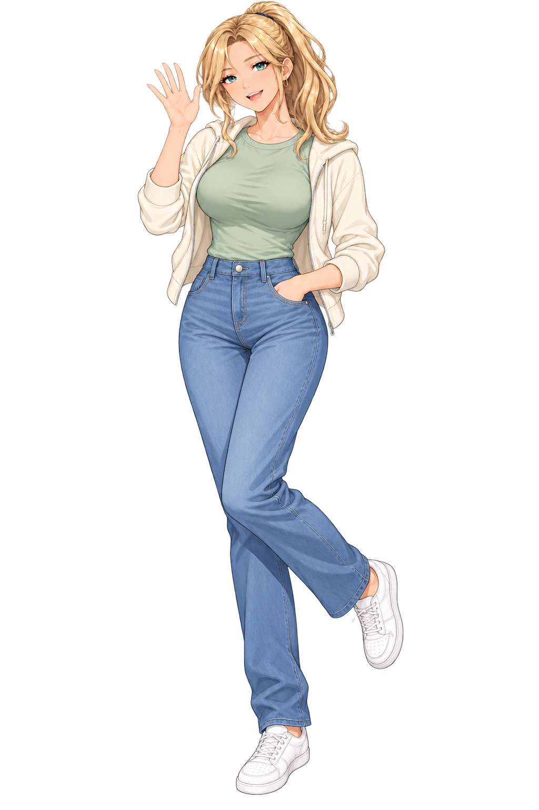
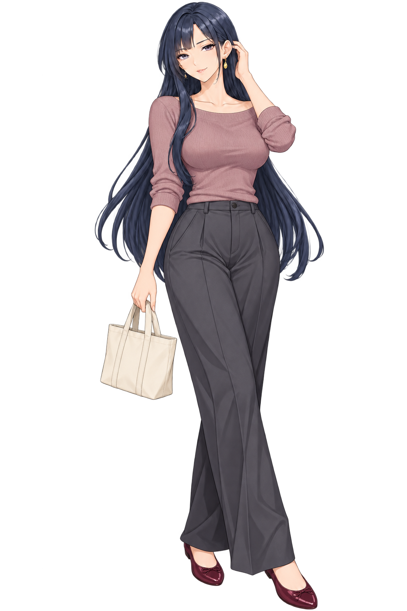
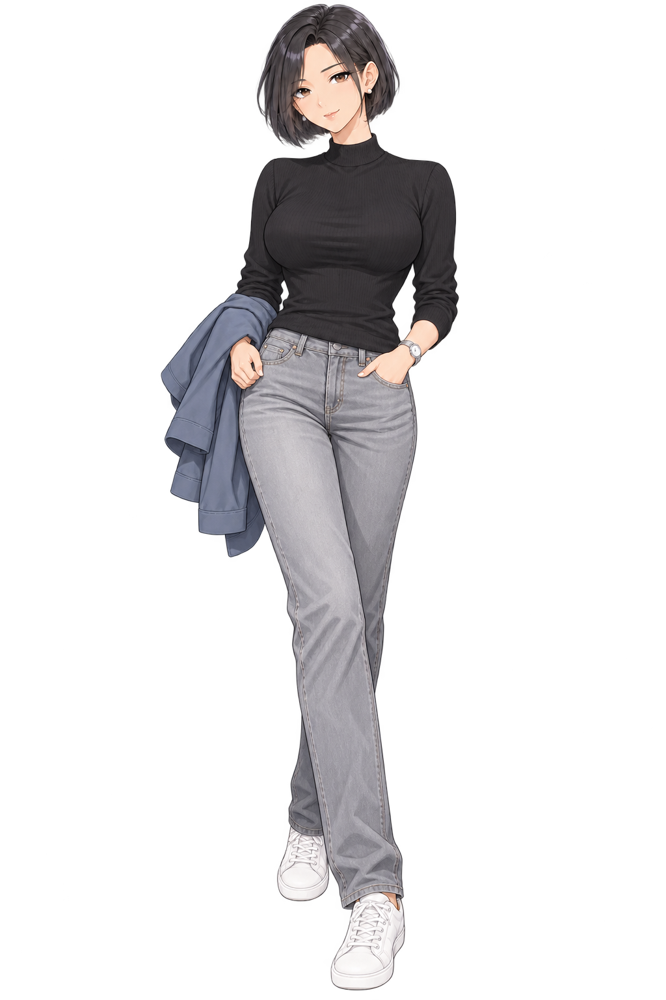

# 사복 포즈 후보 · 2026-10-08

> 제작·검수 시점의 기록입니다. 현재 파일은 [폴더 안내](../../README.md)에서 확인하세요.

현재 MASTER를 참조해 내장 image_gen으로 히로인별 사복과 새 포즈를 한 장씩 제작했습니다. 기존 MASTER·포즈를 덮어쓰지 않은 후보입니다.

## 한서윤

크기: 1024×1535.

### 생성 프롬프트

Use case: identity-preserve. Asset type: one new casual-clothes full-body Korean romance visual-novel heroine sprite, portrait framing. The supplied image is the immutable identity / body-proportion / illustration-style reference for Han Seoyun, a 40-year-old adult Korean woman. Generate ONLY this same heroine, not a redesign. Preserve the exact mature face, eye spacing and brown eyes, brown low bun and loose side strands, strong elegant eye makeup, closed berry-toned lips with a subtle confident smile, and the ONE small beauty mark at the viewer-right mouth corner. Preserve her reference adult curvy upper-body proportions, slim waist, long legs and small adult head relative to height; hands are mature and sufficiently long, clearly separated anatomically correct fingers. Smooth bare ear lobes, NO earrings or flesh bumps; retain wristwatch. Match the reference's polished anime VN line weight, painterly but clean fabric shading, hair highlights and exact natural peach skin hue. Change only clothing and pose. Outfit: refined off-duty sage-green fitted fine-knit wrap sweater, softly open V neckline at a tasteful level, navy fluid ankle-length A-line skirt with natural folds, dark brown flat ankle boots. No office blouse, no tablet, no heels. Pose: relaxed three-quarter stance toward the viewer, weight resting on one leg, both forearms softly raised to hold a small closed novel vertically against her upper chest, one long-fingered hand holding its lower spine and the other lightly resting over its top edge. Calm adult confidence, not shy or juvenile. Whole character from crown to both shoes fully visible, comfortable margins, standing centered, neutral even lighting. SINGLE sprite only, no panels, labels, lettering, logos or watermark. Genuine transparent alpha background, no gradient, no glow, no colored fringe, no floor shadow. Keep the same face, hairstyle, skin color, body scale and same visual-novel art style as the reference; do not make a photorealistic photo.

## 강리아

크기: 1024×1536.

### 생성 프롬프트

Use case: identity-preserve. Asset type: one new casual-clothes full-body Korean romance visual-novel heroine sprite, portrait framing. Supplied image is the immutable identity/body/art-style reference for Kang Ria, a 27-year-old adult Korean woman. Preserve her exact familiar face, bright turquoise eyes, blonde high ponytail with the same loose curled side locks, natural peach skin color, adult body proportions and long legs, the same small delicate thin GOLD OVAL HOOP earrings with clear open inner spaces and smooth ear lobes, no fused skin protrusions. Match precisely the reference's polished anime visual-novel linework, hair rendering, soft fabric shading and restrained highlights. Change only outfit and pose. Outfit: cream casual zip hoodie worn open, fitted muted mint T-shirt underneath (fully opaque), high-waisted medium-blue straight jeans, clean white low-top sneakers. Hoodie and jeans have believable cloth folds, no logos. Pose: energetic friendly off-duty wave, one hand raised beside and slightly above her head with clearly separated relaxed long adult fingers, the other hand in her front jeans pocket; torso turned a little toward the viewer, one knee bent with that heel lightly raised, balanced plausible stance. Warm modest smile, lively but not exaggerated or giant open mouth. No coffee cup, no formal pencil skirt, no ankle-strap heels, no bag or extra prop. SINGLE standing heroine, crown to both entire shoes visible with generous margins, centered in portrait canvas, neutral even light. Genuine transparent alpha background without any scenery, shadow, glow, dark aura, colored fringe, text, labels, logos or watermark. Do not redesign her identity, hair, body scale, skin hue or illustration style. This is a VN illustration, NOT a photorealistic photo.

## 차유진

크기: 1024×1536.

### 생성 프롬프트

Use case: identity-preserve. Asset type: one new casual-clothes full-body Korean romance visual-novel heroine sprite, portrait framing. Supplied image is the immutable identity/body/art-style reference for Cha Yujin, a 32-year-old adult Korean woman. Preserve her exact familiar mature face, gray-violet eyes, very long dark navy-black hair and bangs, natural peach skin hue, adult curvy torso, slim waist and long legs; preserve the same delicate gold connector and SINGLE gold teardrop earring on each visible ear, smooth anatomically normal ear lobes, no extra jewelry or flesh bumps. Match exactly the reference's elegant clean anime VN linework, glossy but finely shaded hair, controlled soft skin and fabric rendering. Change only outfit and pose. Outfit: relaxed dusty-mauve fine-knit boat-neck sweater with long sleeves loosely pushed to her forearms, fitted neatly at the waist without childish oversized proportions, charcoal high-waisted wide-leg trousers, burgundy flat ballet shoes. No office burgundy dress or high heels. Pose: thoughtful casual three-quarter stance, one hand naturally tucking a loose hair strand behind her ear without obscuring the face, other arm hanging naturally with hand holding the short handles of a small plain cream canvas tote beside her thigh. Slight gentle tilt of head, reserved closed-mouth smile, comfortable adult poise; this is NOT the office chin-touch / crossed-arm pose. Fingers long enough, individually defined, anatomically correct; earrings remain visible and distinct from skin. One SINGLE sprite, whole crown and both entire shoes in frame with comfortable margins; centered portrait canvas; neutral even lighting. Genuine transparent alpha background; no scenery, floor shadow, glow, dark aura, colored fringing, text, logo or watermark. Lock her face identity, hairstyle, body scale and skin hue. Visual novel illustration, NOT a photorealistic photo.

## 백지현

크기: 1024×1536.

### 생성 프롬프트

Use case: identity-preserve. Asset type: one new casual-clothes full-body Korean romance visual-novel heroine sprite, portrait framing. Supplied image is the immutable identity/body/art-style reference for Baek Jihyun, a 36-year-old adult Korean woman. Preserve her exact familiar mature face, brown eyes, short black side-parted bob with the same shape, natural peach skin hue, adult body proportions, long legs, small adult head relative to height, SINGLE small ivory rounded-triangle pearl stud earring at each visible ear with no fused skin bump, and silver wristwatch. Match the reference's polished anime VN linework, silky subtle hair highlights, soft carefully controlled skin and cloth shading. Change only clothing and pose. Outfit: simple fitted black fine-knit mock-neck long-sleeve top, medium-light stone-gray straight-leg jeans, clean white low-top sneakers. Off-duty casual look, clearly different from the black office suit and pencil skirt. A lightweight muted slate-blue casual jacket is folded naturally over one forearm, not worn as an office blazer. Pose: relaxed slight three-quarter walking pause, one hand resting naturally in the front jeans pocket, the opposite forearm holding the folded jacket by her side; one foot half a step ahead; shoulders relaxed, chin level, restrained small closed-mouth smile. No crossed arms, no paper pointing, no hands clasped at the waist. Hands and visible fingers adult-sized, long, cleanly defined and anatomically correct. SINGLE heroine full body, crown and both entire shoes visible with comfortable margins in a centered portrait canvas, neutral even lighting. Genuine transparent alpha background, no scenery, no floor shadow, no glow, no dark aura, no colored fringe, no text/logo/watermark. Do not alter identity, haircut, skin hue or body proportions. Visual novel illustration, NOT a photorealistic photo.

파일 경로·참조 MASTER·원본 생성 경로·체크섬은 제작기록.json에 있습니다.
