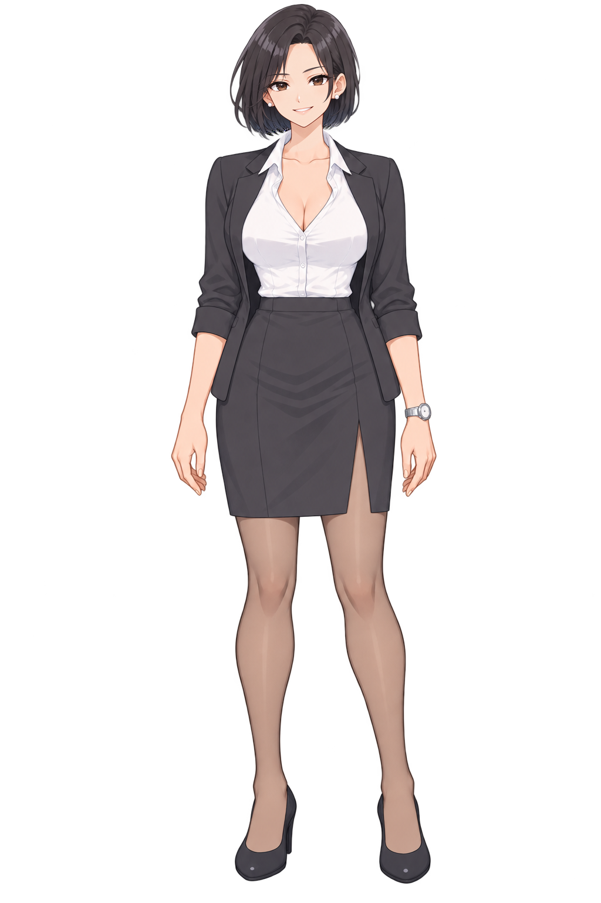
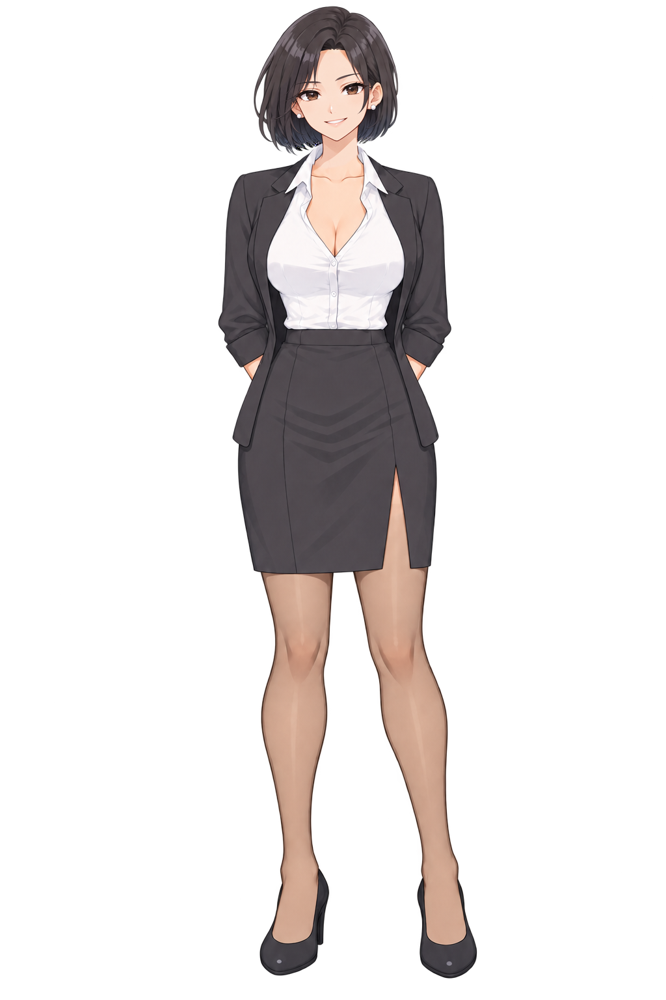
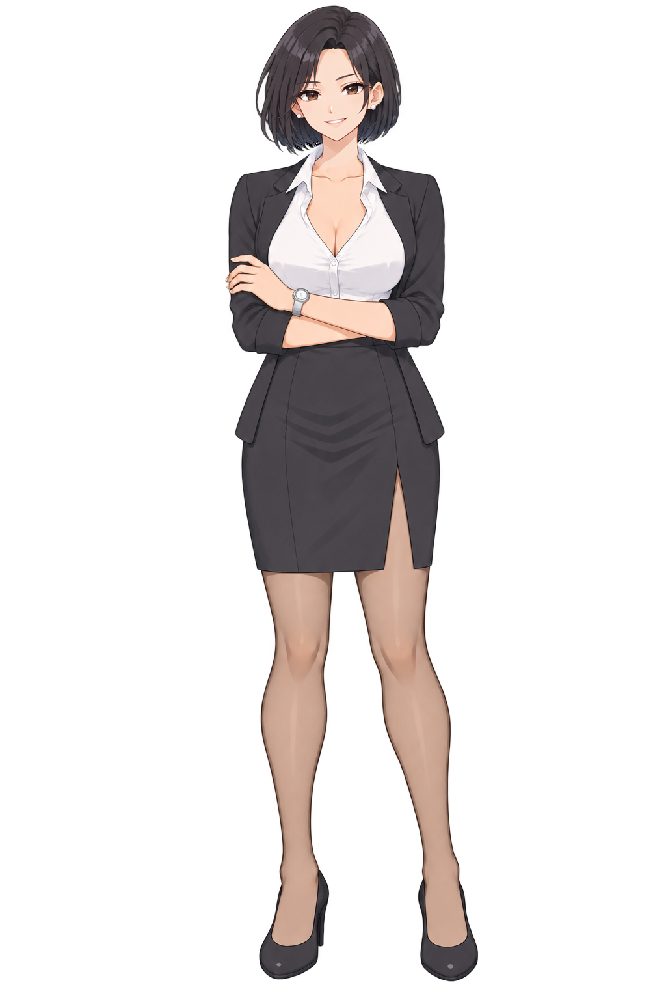
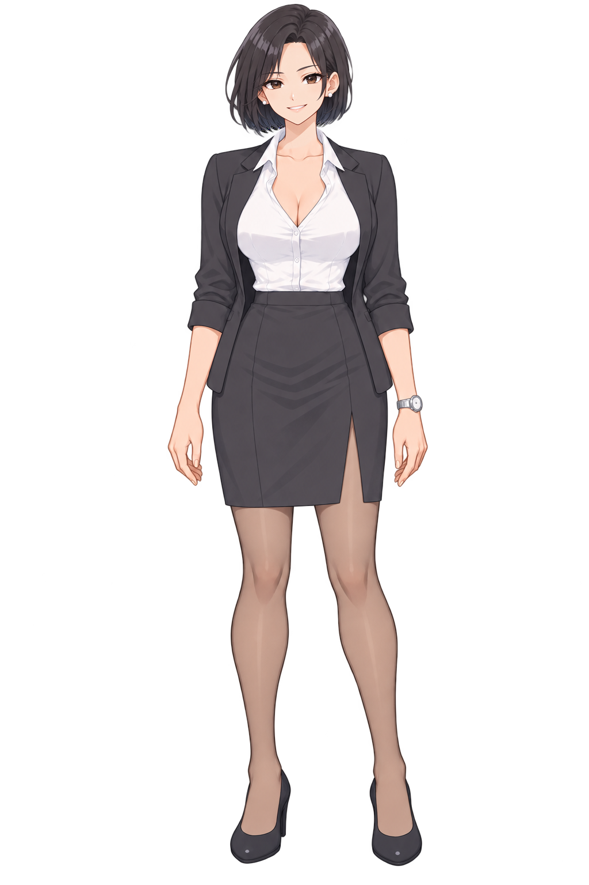
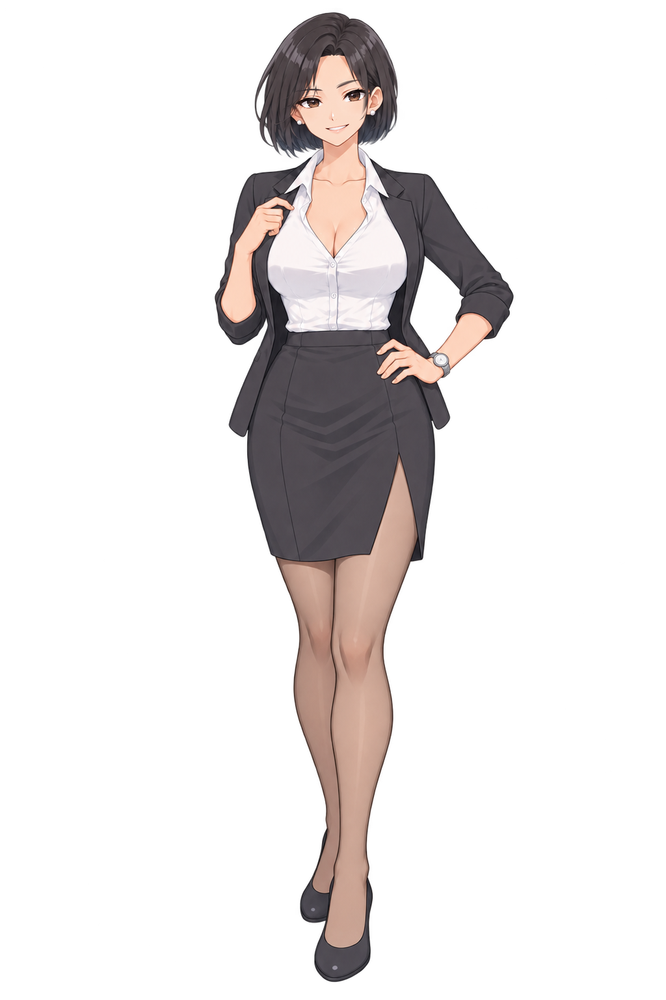
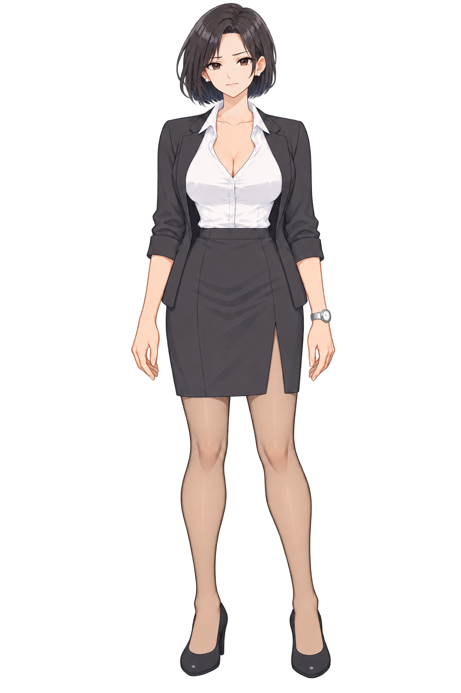
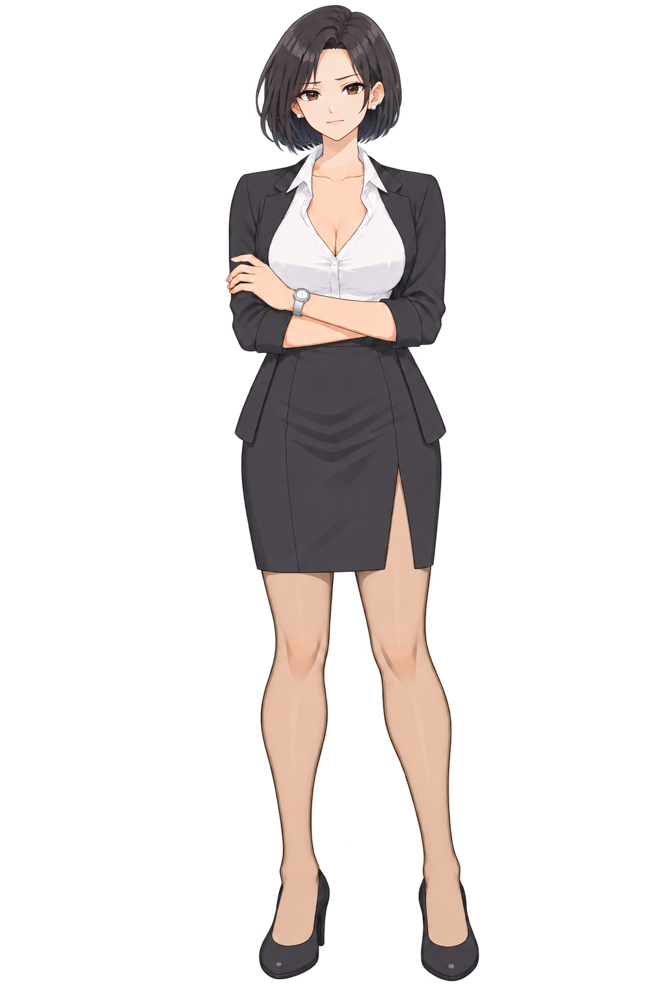
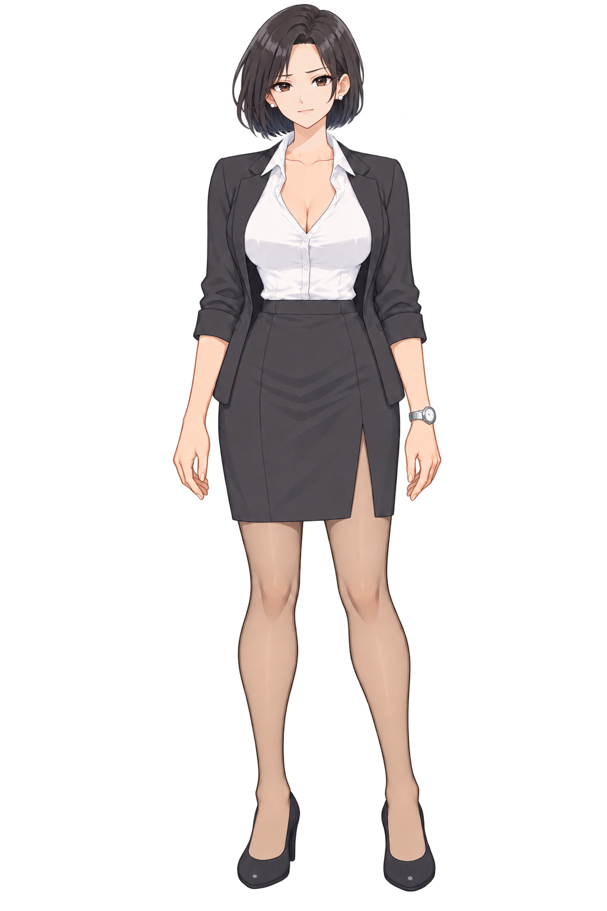

# 백지현

[전체 히로인](../README.md) · **새 작화 이미지 27개**: 원화 11장 · 2배 확대본 11장 · 검수 이미지 5장.

## 정면 MASTER

[원화](MASTER.png) · [2048×3072 확대본](업스케일/MASTER.png)

현재 얼굴 설계: 화장 없이 부드럽게 좁아지는 얼굴형, 더 열린 갈색 아몬드 눈매, 자연스러운 미소. 강리아와 같은 얇은 선화·셀 명암을 유지합니다.

## 포즈

|듣는 자세|업무|캐주얼|대표|
|:---:|:---:|:---:|:---:|
|||||
|[2배 확대](업스케일/포즈/듣는자세.png)|[2배 확대](업스케일/포즈/업무.png)|[2배 확대](업스케일/포즈/캐주얼.png)|[2배 확대](업스케일/포즈/대표.png)|

대표 포즈: 자신감 있는 미소와 정돈된 자세. 현재 무화장 MASTER를 기준으로 표정과 몸짓을 함께 제작했습니다. 실제 대사 두 곳에 연결하고 다음 해당 인물의 일반 대사에서는 기본 장면 자세로 복귀합니다. [대표 포즈 확대 검수](검수자료/대표포즈확대.jpg) · [제작 프롬프트](검수자료/대표포즈_제작프롬프트.json)

## 표정

|자세|기본|진지|
|---|:---:|:---:|
|MASTER|||
|업무|||
|캐주얼|||

[표정 2배 확대본](업스케일/표정/)

## 검수

[전신](검수자료/전신10장.jpg) · [얼굴](검수자료/얼굴10장.jpg) · [귀·귀걸이](검수자료/귀걸이확대.png) · [손](검수자료/손확대.png) · [검수 기록](검수자료/README.md)

기본 표정은 같은 MASTER/포즈 파일을 사용합니다. 캐주얼은 정면 MASTER를 재사용했습니다. 눈·귀·귀걸이·손과 전신 작화를 확대 확인했습니다. 2배 확대는 작화를 유지하는 Lanczos3 리샘플링이며 새 디테일을 임의로 생성하지 않았습니다. 생성형 편집으로 미세한 형태 차이가 있습니다. 이전 사복·작업본 이미지는 제거했고, 해당 장면은 새 MASTER를 사용합니다. 게임에서는 새 확대본과 표정 파일을 사용하며 이전 색상 보정은 적용하지 않습니다.

2026-10-10 갱신: 네 명 모두 화장 전 이미지로 복원했습니다. 백지현은 눈매·턱선·미소를 다시 설계하고 모든 포즈·표정에 같은 얼굴을 적용했습니다. 전신·복장·손은 유지했습니다.

2026-10-10 최신 외형: 갈색 눈의 생기와 작게 치아가 보이는 밝고 자신감 있는 미소, 무화장 상태 유지. MASTER·포즈·표정·대표 포즈·2배 확대본과 게임용 파일에 반영했습니다.
