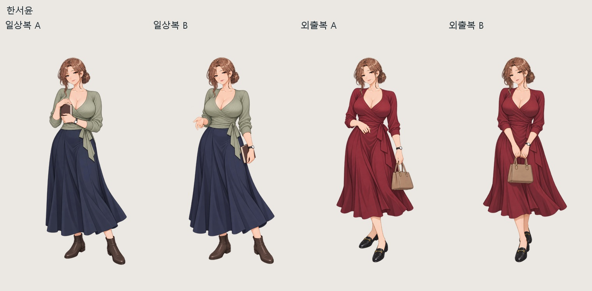
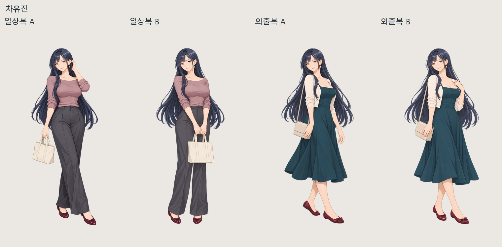
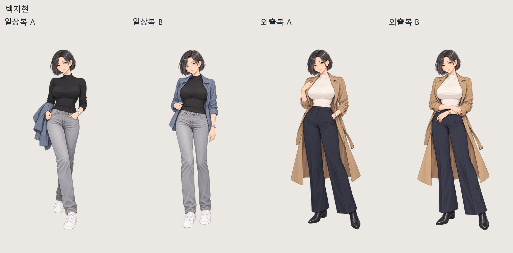

# 사복 16장 · 2026-10-08

히로인별 일상복 2포즈 + 외출복 2포즈, 총 16장입니다. 앞서 만든 4장과 새로 생성한 12장을 모두 업스케일했습니다.

최종 PNG는 **2048×3072 RGBA**입니다. 원화 16장은 `원화`, 확대본 16장은 `업스케일`, 비교 미리보기는 `검수`에 있습니다.

## 한서윤

- [일상복 A](업스케일/seoyun_daily_a_2x.png)
- [일상복 B](업스케일/seoyun_daily_b_2x.png)
- [외출복 A](업스케일/seoyun_date_a_2x.png)
- [외출복 B](업스케일/seoyun_date_b_2x.png)

## 강리아

- [일상복 A](업스케일/ria_daily_a_2x.png)
- [일상복 B](업스케일/ria_daily_b_2x.png)
- [외출복 A](업스케일/ria_date_a_2x.png)
- [외출복 B](업스케일/ria_date_b_2x.png)

## 차유진

- [일상복 A](업스케일/yujin_daily_a_2x.png)
- [일상복 B](업스케일/yujin_daily_b_2x.png)
- [외출복 A](업스케일/yujin_date_a_2x.png)
- [외출복 B](업스케일/yujin_date_b_2x.png)

## 백지현

- [일상복 A](업스케일/jihyun_daily_a_2x.png)
- [일상복 B](업스케일/jihyun_daily_b_2x.png)
- [외출복 A](업스케일/jihyun_date_a_2x.png)
- [외출복 B](업스케일/jihyun_date_b_2x.png)

## 제작 방식

내장 image_gen으로 생성했습니다. 각 의상의 두 번째 포즈는 첫 번째 이미지를 직접 참조했습니다.

업스케일은 Real-ESRGAN general 4배 결과를 2배로 줄이고 원화 일반 확대 60% + SR 40%를 혼합했습니다. 투명도는 정규화 원화의 2배 확대 그대로입니다. 비율을 유지한 균일 축소와 투명 여백만 사용했고 얼굴·몸을 따로 늘리지 않았습니다. 원본 파일은 변경하지 않았습니다. 별도 눈/입/얼굴 복원 패치를 적용하지 않았습니다.

후보 이미지 모음입니다. 기존 MASTER와 게임용 스프라이트는 교체하지 않았습니다. 정확한 생성 프롬프트, 참조 이미지와 검증 지문은 [제작기록](제작기록.json)에 있습니다.

압축 파일에는 업스케일 PNG 16장과 비교 미리보기·제작기록이 들어 있습니다. 원화 PNG 16장은 프로젝트의 원화 폴더에 따로 보관했습니다.
