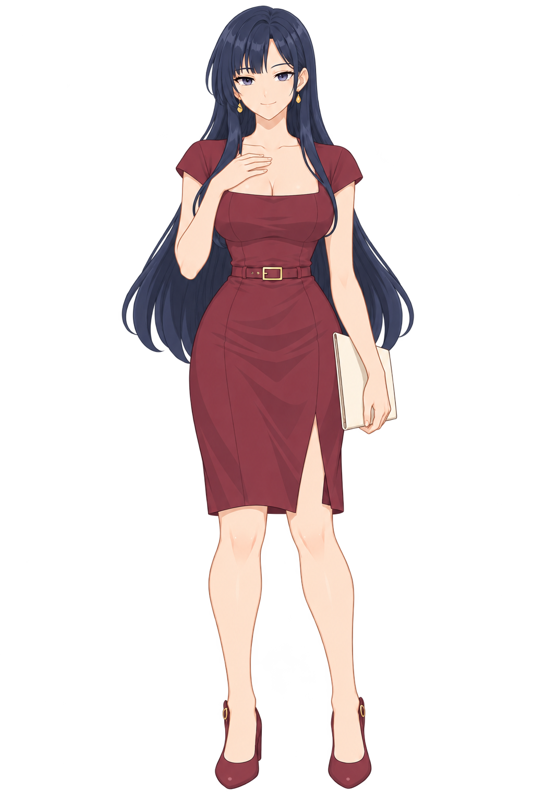
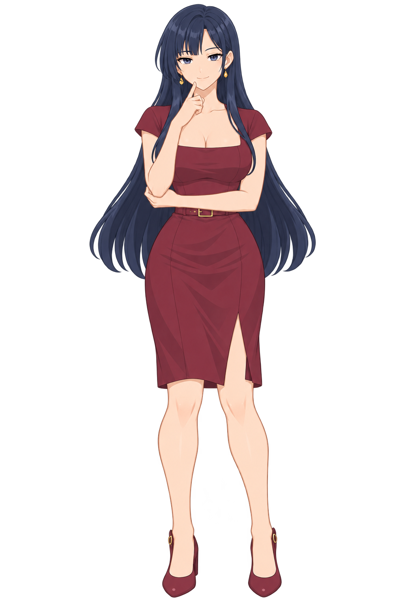
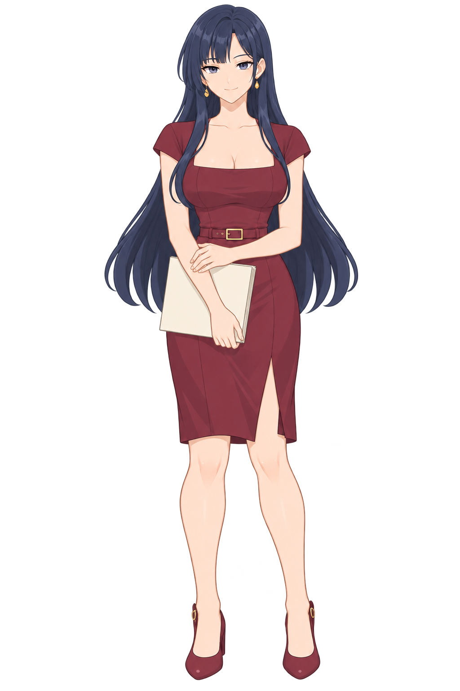
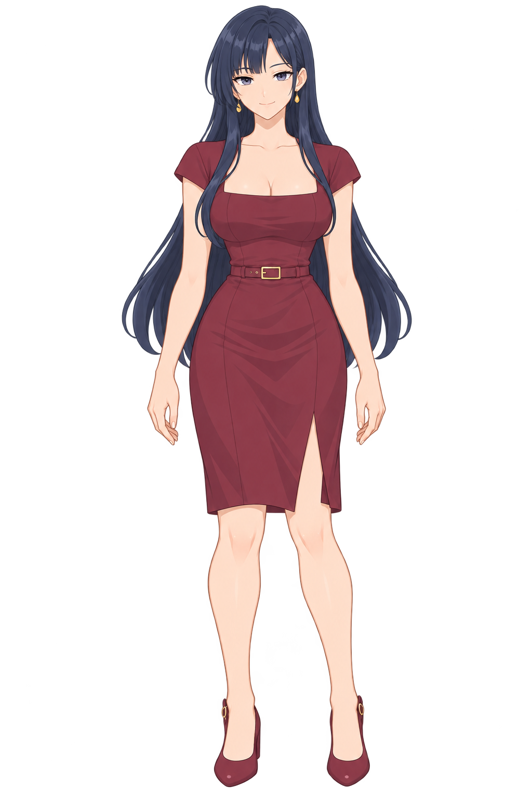
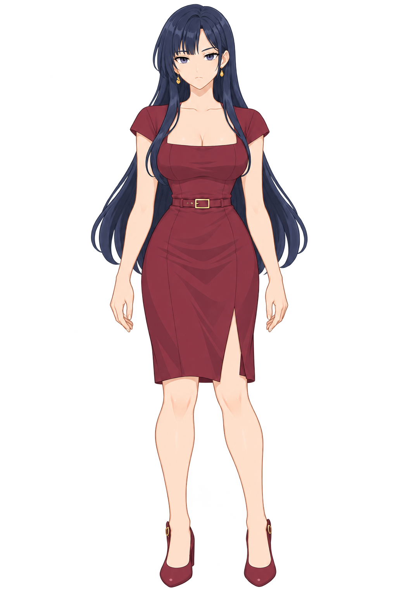
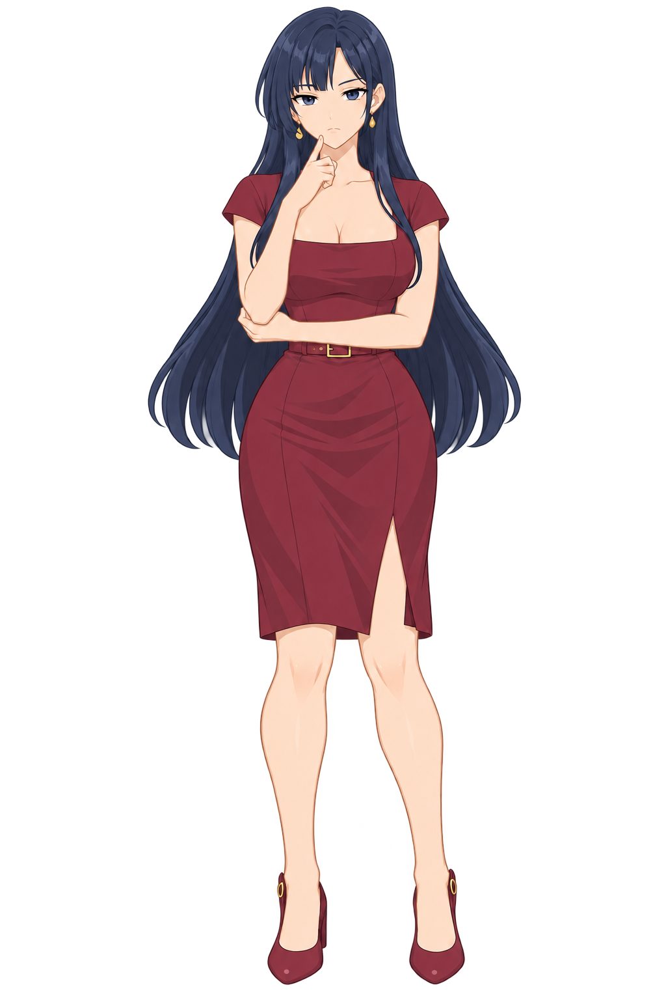

# 차유진

[전체 히로인](../README.md) · **새 작화 이미지 24개**: 원화 10장 · 2배 확대본 10장 · 검수 이미지 4장.

## 정면 MASTER

[원화](MASTER.png) · [2048×3072 확대본](업스케일/MASTER.png)

2026-10-10 재제작: 강리아를 첫 번째 작화 기준으로 삼아 눈 윤곽·홍채·코·입·얼굴형을 다시 그렸습니다. 피부와 옷은 단순한 셀 명암으로 정리하고 구두의 강한 반사띠를 제거했습니다. 인물별 머리색·눈색·복장·귀걸이 디자인은 유지했습니다.

## 포즈

|듣는 자세|업무|캐주얼|
|:---:|:---:|:---:|
||||
|[2배 확대](업스케일/포즈/듣는자세.png)|[2배 확대](업스케일/포즈/업무.png)|[2배 확대](업스케일/포즈/캐주얼.png)|

## 표정

|자세|기본|진지|
|---|:---:|:---:|
|MASTER|||
|업무|||
|캐주얼|||

[표정 2배 확대본](업스케일/표정/)

## 검수

[전신](검수자료/전신10장.jpg) · [얼굴](검수자료/얼굴10장.jpg) · [귀·귀걸이](검수자료/귀걸이확대.png) · [손](검수자료/손확대.png) · [검수 기록](검수자료/README.md)

기본 표정은 같은 MASTER/포즈 파일을 사용합니다. 눈·귀·귀걸이·손과 전신 작화를 확대 확인했습니다. 2배 확대는 작화를 유지하는 Lanczos3 리샘플링이며 새 디테일을 임의로 생성하지 않았습니다. 생성형 편집으로 미세한 형태 차이가 있습니다. 이전 사복·작업본 이미지는 제거했고, 해당 장면은 새 MASTER를 사용합니다. 게임에서는 새 확대본과 표정 파일을 사용하며 이전 색상 보정은 적용하지 않습니다.
