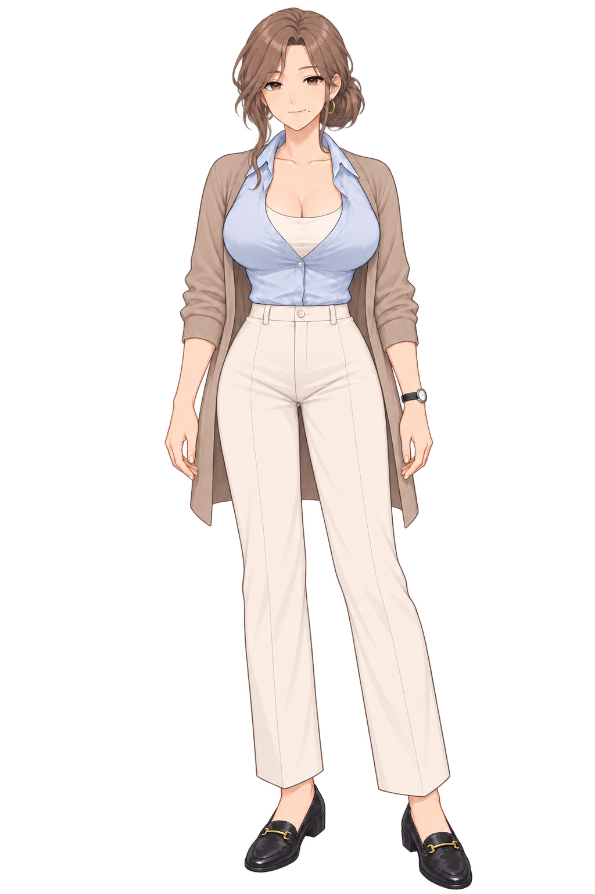
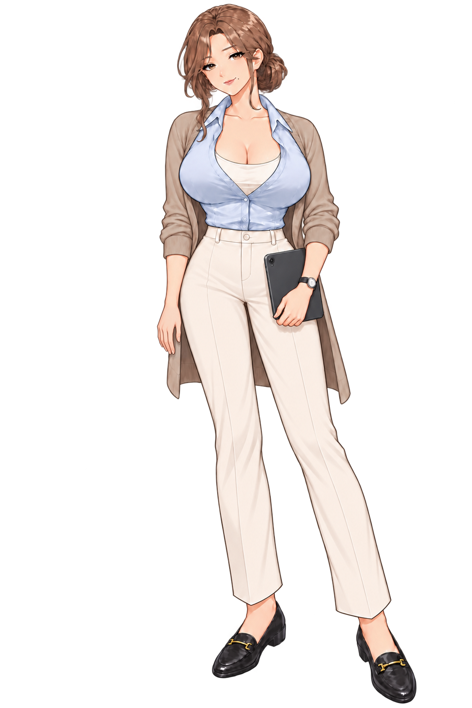

# 한서윤

[전체 히로인](../README.md) · **이미지 22개**

## MASTER

## 듣는 자세

## 포즈

|업무|캐주얼|
|:---:|:---:|
|||

## 표정

default는 기본 표정, serious는 진지 표정입니다.

|포즈|default · 기본|serious · 진지|
|---|:---:|:---:|
|업무|||
|캐주얼|||
|MASTER|||

## 사복

|의상·포즈|원화 · 약 1024×1536|업스케일 · 2048×3072|
|---|---|:---:|
|일상 A|[원화](사복/원화/일상_A.png)||
|일상 B|[원화](사복/원화/일상_B.png)||
|외출 A|[원화](사복/원화/외출_A.png)||
|외출 B|[원화](사복/원화/외출_B.png)||

[사복 포즈 예시](사복/포즈예시.png) · [이 인물의 검수 자료](검수자료/)
